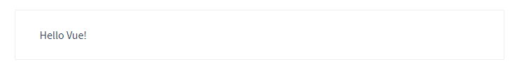

# 一、Vue 基础

## 1、 框架 前置

### 1.1 为什么要学习流行框架？

企业为了提高效率，时间就是金钱。

开发人员：提高了开发效率

```js
思考： 为什么 原生JS开发 不高效？

-> 举例： 点击 某个 DOM元素，但 要阻止冒泡：

  const box = document.querySelector(".box");

  // 考虑 浏览器的兼容性
  box.addEventListener("click", (e) => {
    // 事件对象 的 兼容性 写法：
    e = e || window.event;

    // 阻止 冒泡 - 阻止事件冒泡也 需要兼容性写法：
    e.stopPropagation(); // 阻止事件冒泡
    e.cancelBubble = true; // 阻止事件冒泡 的 兼容性写法

    console.log("点击了 box...");
  });
```


JS => JQuery => 框架时代（React、Vue）

- JS：原生 JS 直接操作DOM元素
- JQuery库（流行事件2005年~2015年）：提供的大量的**函数**简化操作DOM 并且解决DOM操作的浏览器兼容性问题。
- 框架（Angular - 谷歌出品 - 现在国内几乎不使用了、React - Facebook 出品、Vue）：提供了一整套全新的、高效的前端开发方案：

### 1.3 前端框架与库的区别？

- 功能层面

  jquery库：操作DOM + 网络请求后端数据

  框架：提供全方位功能，齐全

  如果把库比作肯德基的小套餐的话，框架就类似于KFC的全家桶级别的。

- 代码层面

  库：是为了实现某个页面功能，而调用某个函数；

  框架：在框架**提供的自己语法**和规则下完成页面功能的开发

- 总结

  库：在JS的基础上，引入和使用库的各种函数；

  框架：大而沉，有自己完整的语法，相比库的学习成本更高，但开发效率也更高。
  
  

### 框架所提供的重要功能和特性：

- 如 **数据的响应式（数据驱动视图）** 
- 组件化
- 渐进式
- ...

### 1.4 思考：前端的的主要工作内容？

```js
工作中：前端的主要工作内容？

-> 后端给咱前端数据，将后端给的数据，绘制到 页面中。
```


> ##### 01-原生JS 如何将数据渲染在页面中.html
>
> ```html
> <script>
>   // 后端返回的数据：
>   const model = { // 注：model 表示数据（data）
>     content: '千锋数字智慧大前端'
>   }
> </script>
> 
> // 思考1：如何 使用 JS 将 model 中的数据，以下述形式 绘制到 视图（页面）中
> //  ->  使用 `render` 函数实现
> <div id="app">
>   <h1>${model.content}</h1>
> </div>
> 
> ```
>
> ```html
> <script>
>   // 思考2：若 model 的数据发生改变，如何 将改变后的数据，更新至 视图（页面）中
>   //  -> 再执行一次 render 函数，（render 函数的 作用：根据 model 绘制页面）
>   const model = { // 注：model 表示数据（data）
>     content: '数据被更新...'
>   }
> </script>
> 
> 
> <div id="app">
>   <h1>${model.content}</h1>
> </div>
> 
> // 思考：上述JS操作缺点是什么？
> ->  数据被改变了，需要 人工/手动 执行 render 函数。
> - -> 不能自动执行，所以 非常麻烦。
> 
> 
> // 理想状态，应该怎样？
> //  ->  数据被改变，自动 执行 render 函数；
>       ->  上述的自动化的过程，即 「数据的响应式（数据驱动视图）」。
> ```


### 1.5 MVVM 架构模式（Vue 实现 数据响应式 的 设计模式）

目标：理解 MVVM设计模式的思想 与 作用


MVVM 其实是指三部分：

- **M** 指的是：**M**odel层 是数据模型，即用来存储后端返回的数据；
- **V** 指的是：**V**iew层 是视图（即浏览器页面），展示Model层的数据。
- **VM** 指的是：**V**iew**M**odel(视图模型)，其同时监测Model层和View层，只要一方发生变化，则 VM便会自动更改另一方；最终使两方的内容保持一致。

```vue
<script>
	// Model 层
  const model = { // 注：model 表示数据（data）
    content: '数据被更新...'
  }
</script>

// View 层
<div id="app">
  <h1>${model.content}</h1>
</div>

```


##### 特性：

1. **数据驱动视图** 

   好处：当Model层发生数据变化时，页面会自动重新渲染。开发人员只维护好数据的变化，页面结构会被VM会自动渲染出来。

2. 双向数据绑定

   举个栗子：当视图中有 <input /> 若其值发生变化，则 vm 会自动把最新的值取出来，更新到数据。

   好处：开发人员不再需要手动操作DOM元素，来获取表单元素输入的最新值；js数据的变化，会被自动渲染到页面上。

　Vue.js 是一个提供了 MVVM 风格的双向数据绑定的 Javascript 库，专注于View 层。

​	它的核心是 MVVM 中的 **VM**，也就是 ViewModel。 

​	ViewModel负责连接 View 和 Model，保证视图和数据的一致性，这种轻量级的架构让前端开发更加高效、便捷。


## 2、Vue 介绍

### 2.1  简介

Vue 是一个国产框架，之前所学的JQuery库、Bootstrap，基本都诞生于国外。像Vue这种优秀的国产框架少之又少，它的作者是国内大神—尤雨溪。


Vue (读音 /vjuː/，类似于 view) 是一套用于构建用户界面的**渐进式框架**。与其它大型框架不同的是，Vue 被设计为可以自底向上逐层应用。**Vue** **的核心库只关注视图层**，不仅易于上手，还便于与第三方库或既有项目整合。另一方面，当与现代化的工具链以及各种支持类库结合使用时，Vue 也完全能够为复杂的单页应用提供驱动。


**兼容性**：**Vue 不支持 IE8 及以下版本**，因为 Vue 使用了 IE8 无法模拟的 ECMAScript 5 特性。但它支持所有兼容 ECMAScript 5 的浏览器。

**IE：它是一个用来下载其他浏览器的好工具**


### 2.2 市场地位

Vue.js 是前端的**主流框架之一**，和Angular.js、React.js 一起，并成为前端三大主流框架！

+ React 和 Vue 有许多相似之处，它们都有：

  - 使用 Virtual DOM 
  - 提供了 响应式 (Reactive) 和 组件化 (Composable) 的视图组件。
  - 将注意力集中保持在核心库，而将其他功能如路由和全局状态管理交给相关的库。

+ Vue.js的优点：

  1. 体积小，压缩后只有33kb

  2. 更高的运行效率，基于虚拟dom原理。

     一种可以预先通过JavaScript进行各种计算，把最终的DOM操作计算出来并优化的技术，由于这个DOM操作属于预处理操作，并没有真实的操作DOM，所以叫做虚拟DOM。

  3. 双向数据绑定原理。

     让开发者不用再去操作dom对象，把更多精力投入到业务逻辑上

  4. 生态丰富、学习成本低。

     市面上成熟、稳重的基于vue.js的UI框架、常用组件多。

     基于以上原因，Vue.js对初学者友好，容易上手。国内中小企业用的较多。

  

### 2.3 Vue2 和 Vue3

- ** Vue2 官网：https://v2.cn.vuejs.org/
- Vue3 官网：https://cn.vuejs.org/
- 授课路线：先 vue2 再 vue3
  - Vue2 的编程范式(风格)：典型的 面向对象    ->   `new 构造函数()`
  - Vue3 的编程范式(风格)：面向对象  +  面向函数


## 3、Vue 初体验

### 3.1 Vue使用方式

- 方式一：直接CDN引入

  以选择引入开发环境版本还是生产环境版本

  ```html
  <!-- 开发环境版本，包含了有帮助的命令行警告 --> 
  <script src="https://cdn.jsdelivr.net/npm/vue/dist/vue.js"></script>
  <!-- 生产环境版本，优化了尺寸和速度 -->
  <script src="https://cdn.jsdelivr.net/npm/vue"></script>
  ```

- 方式二：下载并引入（**==初学者推荐==**）

  开发环境 ：https://v2.cn.vuejs.org/js/vue.js  

  生产环境 ：https://v2.cn.vuejs.org/js/vue.min.js  

### 3.2 Vue 基本使用

Vue.js 的html代码写法，是一个允许采用简洁的 模板语法 来声明式地将数据渲染进 DOM 的系统。

```html
<div id="app">
  <h1>{{content}}</h1>
</div>
```

每个 Vue 应用都是通过用 `Vue` 函数创建一个新的 **Vue 实例**开始的：

```javascript
const vm = new Vue({  // Vue实例
  el: '#app',    //目的地，挂载点
  data: {		//数据
    content: '千锋数字智慧大前端'
  }
})
```

我们已经成功创建了第一个 Vue 应用！

看起来这跟渲染一个字符串模板非常类似，但是 Vue 在背后做了大量工作。

现在数据和 DOM 已经被建立了关联，所有东西都是**响应式的**。

```vue
// 我们要怎么确认呢？
```


> ##### 01.vue初体验.html
>
> ```html
> <!DOCTYPE html>
> <html lang="en">
> 
> <head>
>  <meta charset="UTF-8">
>  <meta http-equiv="X-UA-Compatible" content="IE=edge">
>  <meta name="viewport" content="width=device-width, initial-scale=1.0">
>  <title>Document</title>
>  </head>
>    <body>
>      <div id="app">
>        <h1>{{content}}</h1>
>     </div>
>   </body>
> </html>
>  <script src="./vue.js"></script> 
>  <script>
>    var vm = new Vue({  // Vue实例
>        el: '#app',    //目的地，挂载点
>      data: {		//数据
>        content: '千锋数字智慧大前端'
>        }
>    })
>    
>    </script>
>    ```


#### 总结：

1. 引入vue.js
2. 在body中创建一个挂载点
3. new Vue，挂载到挂载点上


> 使用vue的第一个好处：但凡 data 中声明的 属性 均可被挂载到 `{{  }}` 中，且data中的属性具有 **数据的响应式** 。


### 3.3 开发者工具

在使用 Vue 时，我们推荐在你的浏览器上安装 **Vue Devtools**。它允许你在一个更友好的界面中审查和调试 Vue 应用

##### 安装chrome插件的方式：


##### devtools不显示处理方式：


## 4、模板语法

​		Vue.js 使用了基于 HTML 的模板语法  -> “Mustache”语法，胡须 - 被俗称为 **「大胡子」** 

​		模板语法的作用：new Vue 下很多 JS 数据可以直接在 模板语法中被使用   ->  如  data 中的属性，且 模板语法中的数据具有响应性。

数据绑定最常见的形式就是使用“Mustache”语法 (双大括号) 的文本插值：

```html
<div id="app">
  {{ message }}
</div>
```

```js
var vm = new Vue({
  el: '#app',
  data: {
    message: 'Hello Vue!'
  }
})
```

效果：

​	

#### 4.1 {{ 表达式 }} 可以放什么？

- data 中的 任意数据类型

```vue
- 数组
- 对象
```


- 表达式
  - 什么是 表达式？

```vue
->  ['a', 'b', 'c'].map(d => d + '1');  // 也是表达式
->  123 + 111   // 也是表达式
```

>06-模板语法的作用：可以写表达式
>
>```vue
><!DOCTYPE html>
><html lang="en">
>  <head>
>    <meta charset="UTF-8" />
>    <meta http-equiv="X-UA-Compatible" content="IE=edge" />
>    <meta name="viewport" content="width=device-width, initial-scale=1.0" />
>    <title>Document</title>
>  </head>
>  <body>
>    <!-- 注：其 双花括号的代码，不生效 -->
>    <p>{{content}}</p>
>    <div id="app">
>      <h1>{{content}} - {{message}}</h1>
>      <p>数组：{{arr}}</p>
>      <p>对象：{{obj}}</p>
>      <p>表达式 - 数组的map方法：{{arr.map(d => d + '1')}}</p>
>      <p>数字相加的表达式 {{11 + 22}}</p>
>    </div>
>  </body>
></html>
><script src="../packages/vue.js"></script>
><script>
>  const vm = new Vue({
>    // `el` 指的是 `<div id="app">` 的 DOM元素
>    el: "#app", // 将 vue 的代码 生效的「挂载点」
>    data: {
>      // model
>      //数据
>      content: "千锋数字智慧大前端",
>      message: "Hello Vue!",
>      arr: ["a", "b", "c"],
>      obj: {
>        name: "姓名",
>        age: 33,
>      },
>    },
>  });
></script>
>
>```
>
>

## 5、指令语法

```vue
// 概念约定：
 标签的属性：属性名、 标签的属性值 分别的英文 和 简写

<div title="xxx">
  <!-- 
		title 被称为：「属性名」
			->  英文 和 简写： attributr
				-> attrName

		'xxx' 被称为：「属性值」
			-> 英文 和 简写
				->  attrValue
	-->
  
</div>
```


vue中定义好的一些以"v-"开头+具体的名称的 属性，这些属性都有特定的功能。

- 说明

  指令加在标签，在Vue中凡是以 `v-` 开头的都叫做「指令」，加上就会有特定的功能。

- 常见用法

  ```html
  <div v-xx></div>  
  <div v-xx='表达式 或 data中的属性'></div>
  <div v-xx:yy='表达式'> </div>
  ```
  
- 注意

  指令分：自定义指令和内置指令（Vue自带）

​      	内置指令：Vue自带 的，能直接使用的 指令

​      	自定义指令：就是用户自己定义的。扩展功能


下述列举 常用的 内置指令：

### 5.1 文本绑定

#### v-html、v-text

双大括号会将数据解释为普通文本，而非 HTML 代码。为了输出真正的 HTML，需要用到v-html

```html
<p>Using mustaches: {{ rawHtml }}</p>
<p>Using v-html directive: <span v-html="rawHtml"></span></p>
<!-- v-text -->
<p>Using v-text directive: <span v-text="rawHtml"></span></p>
```


#### v-cloak

cloak ：[kləuk]  笼罩，覆盖；隐藏，掩饰的意思

用于隐藏尚未完成编译的 DOM 模板。 {{}}

当使用直接在 DOM 中书写的模板时，可能会出现一种叫做“未编译模板闪现”的情况：用户可能先看到的是还没编译完成的双大括号标签，直到挂载的组件将它们替换为实际渲染的内容。

`v-cloak` 会保留在所绑定的元素上，直到相关组件实例被挂载后才移除。配合像 `[v-cloak] { display: none }` 这样的 CSS 规则，它可以在组件编译完毕前隐藏原始模板。

```html
<style>
  [v-cloak] {
    display: none;
  }
</style>

<!-- 直到编译完成前，`<div>` 将不可见。 -->
<div v-cloak>
  {{ message }}
</div>
```


#### v-pre

元素内具有 `v-pre`，所有 Vue 模板语法都会被保留并按原样渲染。最常见的用例就是显示原始双大括号标签及内容。

```html
 <div v-pre>{{ rawHTML }}</div>
```


>07-vue中常见的指令.html
>
>```vue
><!DOCTYPE html>
><html lang="en">
>  <head>
>    <meta charset="UTF-8" />
>    <meta http-equiv="X-UA-Compatible" content="IE=edge" />
>    <meta name="viewport" content="width=device-width, initial-scale=1.0" />
>    <title>Document</title>
>    <style>
>      [v-cloak] {
>        display: none;
>      }
>    </style>
>  </head>
>  <body>
>    <div id="app">
>      <!-- 注： {{}} 需要被 vue 解析，所以 刷新的 瞬间 `{{}}` 会闪现，因为 vue 还没将 {{}} 解析完成 -->
>      <!-- 注：v-cloak 作用：解决 刷新时的 闪现问题 -->
>      <h1 v-cloak>{{content}} - {{message}}</h1>
>
>      <!-- v-pre 的作用：组织 vue 解析 大胡子中的 表达式 -->
>      <h1 v-pre>{{content}} - {{message}}</h1>
>
>      <!-- v-html 其作用 等价于 `innerHTML` -->
>      <div v-html="rawHtml"></div>
>
>      <!-- v-html 其作用 等价于 `innerText` -->
>      <div v-text="rawHtml"></div>
>    </div>
>  </body>
></html>
><script src="../packages/vue.js"></script>
><script>
>  const vm = new Vue({
>    el: "#app", // 将 vue 的代码 生效的「挂载点」
>    data: {
>      // model
>      //数据
>      content: "千锋数字智慧大前端",
>      message: "Hello Vue!",
>      rawHtml: `<p>我是 字符串的 p 文本</p>`,
>    },
>  });
></script>
>
>```
>
>

###  5.2 属性绑定 - `v-bind` 

思考：若 给标签的 属性值 也能像 `{{ 表达式 }}` 一样，具有响应性，岂不美哉...

-> 而 `v-bind:attrName="表达式"` 就是 为了 实现 标签属性的 响应性的

- v-bind 的简写方式： `:attrName="表达式"`  其是  `v-bind:attrName="表达式"` 的简写形式。

> 绑定属性.html
>
> ```vue
> <!DOCTYPE html>
> <html lang="en">
>   <head>
>     <meta charset="UTF-8" />
>     <meta http-equiv="X-UA-Compatible" content="IE=edge" />
>     <meta name="viewport" content="width=device-width, initial-scale=1.0" />
>     <title>Document</title>
>   </head>
>   <body>
>     <div id="app">
>       <!-- 注： 使用 `v-bind` 指定，可以使得 attrValue 也能使用「表达式」 -->
>       <a v-bind:href="link">{{title}}</a>
> 
>       <!-- v-bind 的简写形式 -->
>       <h1 :title="title">{{title}}</h1>
>     </div>
>   </body>
> </html>
> <script src="../packages/vue.js"></script>
> <script>
>   const vm = new Vue({
>     el: "#app", // 将 vue 的代码 生效的「挂载点」
>     data: {
>       link: "http://www.baidu.com",
>       title: "百度一下",
>     },
>   });
> </script>
> 
> ```


#### 5.2.1 动态绑定类属性

操作元素的 class 列表和内联样式是数据绑定的一个常见需求。

但字符串拼接 class 和 style ，操作麻烦且容易出错。

因此，在将 v-bind 用于 class 和 style 时，Vue.js 做了专门的增强。

表达式结果的类型除了字符串之外，还可以是**对象**或**数组**。

```vue
<!DOCTYPE html>
<html lang="en">
  <head>
    <meta charset="UTF-8" />
    <meta http-equiv="X-UA-Compatible" content="IE=edge" />
    <meta name="viewport" content="width=device-width, initial-scale=1.0" />
    <title>Document</title>
    <style>
      .box {
        width: 100px;
        height: 100px;
        background-color: pink;
      }

      .bold {
        font-weight: 900;
      }
    </style>
  </head>
  <body>
    <div id="app">
      <!-- vue 的 v-bind，对 class 和 style 做了优化：
        其可以是 字符串，也可以是 「对象」和「数组」！  
      -->

      <!-- class 可以是 对象，若 对象的 key 的 value 是 true，则 该 DOM 有 className 为 key 的 class -->
      <div v-bind:class="{ box: flag, bold: true }">对象方式</div>

      <!-- class 的数组写法：类比为 DOM.classList
        注： class 为 数组的时候，此种写法 非常常用！！！
      -->
      <div :class="['box', isBold ? 'bold' : '']">数组形式的 class</div>
    </div>
  </body>
</html>
<script src="../packages/vue.js"></script>
<script>
  const vm = new Vue({
    el: "#app", // 将 vue 的代码 生效的「挂载点」
    data: {
      flag: true,
      isBold: true,
    },
  });
</script>

```


##### 注意：

==在vue 当中 静态class和 动态绑定class 可以同时存在==

```vue
<!-- 注意：在vue 当中 静态class和动态绑定class可以同时存在 -->
<div class="title" v-bind:class="{box:flag,size:3>2}">对象方式</div>
```


#### 5.2.2 动态绑定style属性

- 对象语法

  `v-bind:style` 的对象语法十分直观——看着非常像 CSS，但其实是一个 JavaScript 对象。CSS property 名可以用驼峰式 (camelCase) 或短横线分隔 (kebab-case，记得用引号括起来) 来命名：

  ```html
  <div v-bind:style="{ color: activeColor, fontSize: fontSize + 'px' }"></div>
  ```

  ```js
  data: {
    activeColor: 'red',
    fontSize: 30
  }
  ```

  

- 数组语法

  `v-bind:style` 的数组语法==可以将多个样式对象==应用到同一个元素上：

  ```html
  <div v-bind:style="[baseStyles, overridingStyles]"></div>
  ```

  >style的用法.html
  >
  >```html
  ><!DOCTYPE html>
  ><html lang="en">
  >  <head>
  >    <meta charset="UTF-8" />
  >    <meta http-equiv="X-UA-Compatible" content="IE=edge" />
  >    <meta name="viewport" content="width=device-width, initial-scale=1.0" />
  >    <title>Document</title>
  >  </head>
  >  <body>
  >    <div id="app">
  >      <!-- style 是 对象 的写法 更常用！！！ -->
  >      <div v-bind:style="{ color: 'red', fontSize: fontSize }">对象方式</div>
  >
  >      <div :style="[baseStyles, overridingStyles]">数组的写法</div>
  >    </div>
  >  </body>
  ></html>
  ><script src="../packages/vue.js"></script>
  ><script>
  >  const vm = new Vue({
  >    el: "#app", // 将 vue 的代码 生效的「挂载点」
  >    data: {
  >      fontSize: "50px",
  >      baseStyles: {
  >        color: "blue",
  >        fontSize: 15,
  >      },
  >      overridingStyles: {
  >        background: "black",
  >        color: "white", // 注： 数组中的 对象，其 属性 若发生了 重复，则 后面的 会 覆盖前面的属性
  >      },
  >    },
  >  });
  ></script>
  >
  >```
  >
  >


## 作业

- 组件化、渐进式 概念自行 初步了解
- 今天上课讲过的概念巩固练习
- vue 官网初步浏览、熟悉
  - https://v2.cn.vuejs.org/


### 5.3 条件渲染

原生 js : if  判断

```js
if(true){
    //....
}else if(){
    
}else if(){
    
}else{
    
}
```

在Vue当中，条件渲染用 v-if、v-else-if、v-else、v-show。

#### 5.3.1 v-if

`v-if` 指令用于条件性地渲染一块内容。这块内容只会在指令的表达式返回 true 的时候被渲染

```html
<h1 v-if="awesome">Vue is awesome!</h1>
```

也可以用 `v-else` 添加一个“else 块”：

```html
<h1 v-if="awesome">Vue is awesome!</h1>
<h1 v-else>Oh no </h1>
```

**在template上使用**

因为 `v-if` 是一个指令，所以必须将它添加到一个元素上。但是如果想切换多个元素呢？此时可以把一个 `<template>` 元素当做==不可见的包裹元素==，并在上面使用 `v-if`。最终的渲染结果将不包含 `<template>` 元素。 只起包裹作用

```html
<template v-if="ok">
  <h1>Title</h1>
  <p>Paragraph 1</p>
  <p>Paragraph 2</p>
</template>
```

#### 5.3.2 v-else

你可以使用 `v-else` 指令来表示 `v-if` 的“else 块”：

```html
<div v-if="Math.random() > 0.5">
  Now you see me
</div>
<div v-else>
  Now you don't
</div>
```

`v-else` 元素必须紧跟在带 `v-if` 或者 `v-else-if` 的元素的后面，否则它将不会被识别。

`v-else-if`，顾名思义，充当 `v-if` 的“else-if 块”，可以连续使用：

```html
<div v-if="type === 'A'">
  A
</div>
<div v-else-if="type === 'B'">
  B
</div>
<div v-else-if="type === 'C'">
  C
</div>
<div v-else>
  Not A/B/C
</div>
```

####  5.3.3  v-show

另一个用于根据条件展示元素的选项是 `v-show` 指令。用法大致一样：

```vue
<h1 v-show="ok">Hello!</h1>
```

不同的是带有 `v-show` 的元素始终会被渲染并保留在 DOM 中。`v-show` 只是简单地切换元素的 CSS property `display`


**v-if与v-show比较**

```vue
```


