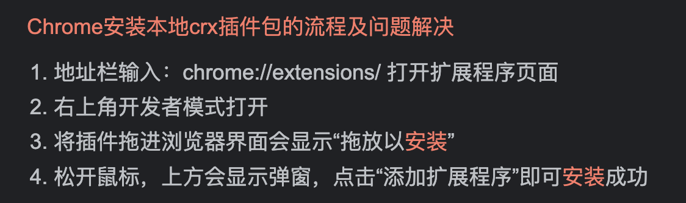

# 一、Vue 基础

## 1、 框架 前置

### 1.1 为什么要学习流行框架？

企业为了提高效率，时间就是金钱。

开发人员：提高了开发效率

```js
思考： 为什么 原生JS开发 不高效？

-> 举例： 点击 某个 DOM元素，但 要阻止冒泡：

  const box = document.querySelector(".box");

  // 考虑 浏览器的兼容性
  box.addEventListener("click", (e) => {
    // 事件对象 的 兼容性 写法：
    e = e || window.event;

    // 阻止 冒泡 - 阻止事件冒泡也 需要兼容性写法：
    e.stopPropagation(); // 阻止事件冒泡
    e.cancelBubble = true; // 阻止事件冒泡 的 兼容性写法

    console.log("点击了 box...");
  });
```

JS => JQuery => 框架时代（React、Vue）

- JS：原生 JS 直接操作 DOM 元素
- JQuery 库（流行事件 2005 年~2015 年）：提供的大量的**函数**简化操作 DOM 并且解决 DOM 操作的浏览器兼容性问题。
- 框架（Angular - 谷歌出品 - 现在国内几乎不使用了、React - Facebook 出品、Vue）：提供了一整套全新的、高效的前端开发方案：

### 1.3 前端框架与库的区别？

- 功能层面

  jquery 库：操作 DOM + 网络请求后端数据

  框架：提供全方位功能，齐全

  如果把库比作肯德基的小套餐的话，框架就类似于 KFC 的全家桶级别的。

- 代码层面

  库：是为了实现某个页面功能，而调用某个函数；

  框架：在框架**提供的自己语法**和规则下完成页面功能的开发

- 总结

  库：在 JS 的基础上，引入和使用库的各种函数；

  框架：大而沉，有自己完整的语法，相比库的学习成本更高，但开发效率也更高。

### 框架所提供的重要功能和特性：

- 如 **数据的响应式（数据驱动视图）**
- 组件化
- 渐进式
- ...

### 1.4 思考：前端的的主要工作内容？

```js
工作中：前端的主要工作内容？

-> 后端给咱前端数据，将后端给的数据，绘制到 页面中。
```

> ##### 01-原生 JS 如何将数据渲染在页面中.html
>
> ```html
> <script>
>   // 后端返回的数据：
>   const model = {
>     // 注：model 表示数据（data）
>     content: "千锋数字智慧大前端",
>   };
> </script>
>
> // 思考1：如何 使用 JS 将 model 中的数据，以下述形式 绘制到 视图（页面）中 //
> -> 使用 `render` 函数实现
> <div id="app">
>   <h1>${model.content}</h1>
> </div>
> ```
>
> ```html
> <script>
>   // 思考2：若 model 的数据发生改变，如何 将改变后的数据，更新至 视图（页面）中
>   //  -> 再执行一次 render 函数，（render 函数的 作用：根据 model 绘制页面）
>   const model = {
>     // 注：model 表示数据（data）
>     content: "数据被更新...",
>   };
> </script>
>
> <div id="app">
>   <h1>${model.content}</h1>
> </div>
>
> // 思考：上述JS操作缺点是什么？ -> 数据被改变了，需要 人工/手动 执行 render
> 函数。 - -> 不能自动执行，所以 非常麻烦。 // 理想状态，应该怎样？ // ->
> 数据被改变，自动 执行 render 函数； -> 上述的自动化的过程，即
> 「数据的响应式（数据驱动视图）」。
> ```

### 1.5 MVVM 架构模式（Vue 实现 数据响应式 的 设计模式）

目标：理解 MVVM 设计模式的思想 与 作用


MVVM 其实是指三部分：

- **M** 指的是：**M**odel 层 是数据模型，即用来存储后端返回的数据；
- **V** 指的是：**V**iew 层 是视图（即浏览器页面），展示 Model 层的数据。
- **VM** 指的是：**V**iew**M**odel(视图模型)，其同时监测 Model 层和 View 层，只要一方发生变化，则 VM 便会自动更改另一方；最终使两方的内容保持一致。

```vue
<script>
// Model 层
const model = {
  // 注：model 表示数据（data）
  content: "数据被更新...",
};
</script>

// View 层
<div id="app">
  <h1>${model.content}</h1>
</div>
```

##### 特性：

1. **数据驱动视图**

   好处：当 Model 层发生数据变化时，页面会自动重新渲染。开发人员只维护好数据的变化，页面结构会被 VM 会自动渲染出来。

2. 双向数据绑定

   举个栗子：当视图中有 <input /> 若其值发生变化，则 vm 会自动把最新的值取出来，更新到数据。

   好处：开发人员不再需要手动操作 DOM 元素，来获取表单元素输入的最新值；js 数据的变化，会被自动渲染到页面上。

Vue.js 是一个提供了 MVVM 风格的双向数据绑定的 Javascript 库，专注于 View 层。

 它的核心是 MVVM 中的 **VM**，也就是 ViewModel。

 ViewModel 负责连接 View 和 Model，保证视图和数据的一致性，这种轻量级的架构让前端开发更加高效、便捷。

## 2、Vue 介绍

### 2.1 简介

Vue 是一个国产框架，之前所学的 JQuery 库、Bootstrap，基本都诞生于国外。像 Vue 这种优秀的国产框架少之又少，它的作者是国内大神—尤雨溪。


Vue (读音 /vjuː/，类似于 view) 是一套用于构建用户界面的**渐进式框架**。与其它大型框架不同的是，Vue 被设计为可以自底向上逐层应用。**Vue** **的核心库只关注视图层**，不仅易于上手，还便于与第三方库或既有项目整合。另一方面，当与现代化的工具链以及各种支持类库结合使用时，Vue 也完全能够为复杂的单页应用提供驱动。


**兼容性**：**Vue 不支持 IE8 及以下版本**，因为 Vue 使用了 IE8 无法模拟的 ECMAScript 5 特性。但它支持所有兼容 ECMAScript 5 的浏览器。

**IE：它是一个用来下载其他浏览器的好工具**


### 2.2 市场地位

Vue.js 是前端的**主流框架之一**，和 Angular.js、React.js 一起，并成为前端三大主流框架！

- React 和 Vue 有许多相似之处，它们都有：

  - 使用 Virtual DOM
  - 提供了 响应式 (Reactive) 和 组件化 (Composable) 的视图组件。
  - 将注意力集中保持在核心库，而将其他功能如路由和全局状态管理交给相关的库。

- Vue.js 的优点：

  1. 体积小，压缩后只有 33kb

  2. 更高的运行效率，基于虚拟 dom 原理。

     一种可以预先通过 JavaScript 进行各种计算，把最终的 DOM 操作计算出来并优化的技术，由于这个 DOM 操作属于预处理操作，并没有真实的操作 DOM，所以叫做虚拟 DOM。

  3. 双向数据绑定原理。

     让开发者不用再去操作 dom 对象，把更多精力投入到业务逻辑上

  4. 生态丰富、学习成本低。

     市面上成熟、稳重的基于 vue.js 的 UI 框架、常用组件多。

     基于以上原因，Vue.js 对初学者友好，容易上手。国内中小企业用的较多。

### 2.3 Vue2 和 Vue3

- \*\* Vue2 官网：https://v2.cn.vuejs.org/
- Vue3 官网：https://cn.vuejs.org/
- 授课路线：先 vue2 再 vue3
  - Vue2 的编程范式(风格)：典型的 面向对象 -> `new 构造函数()`
  - Vue3 的编程范式(风格)：面向对象 + 面向函数

## 3、Vue 初体验

### 3.1 Vue 使用方式

- 方式一：直接 CDN 引入

  以选择引入开发环境版本还是生产环境版本

  ```html
  <!-- 开发环境版本，包含了有帮助的命令行警告 -->
  <script src="https://cdn.jsdelivr.net/npm/vue/dist/vue.js"></script>
  <!-- 生产环境版本，优化了尺寸和速度 -->
  <script src="https://cdn.jsdelivr.net/npm/vue"></script>
  ```

- 方式二：下载并引入（**==初学者推荐==**）

  开发环境 ：https://v2.cn.vuejs.org/js/vue.js

  生产环境 ：https://v2.cn.vuejs.org/js/vue.min.js

### 3.2 Vue 基本使用

Vue.js 的 html 代码写法，是一个允许采用简洁的 模板语法 来声明式地将数据渲染进 DOM 的系统。

```html
<div id="app">
  <h1>{{content}}</h1>
</div>
```

每个 Vue 应用都是通过用 `Vue` 函数创建一个新的 **Vue 实例**开始的：

```javascript
const vm = new Vue({
  // Vue实例
  el: "#app", //目的地，挂载点
  data: {
    //数据
    content: "千锋数字智慧大前端",
  },
});
```

我们已经成功创建了第一个 Vue 应用！

看起来这跟渲染一个字符串模板非常类似，但是 Vue 在背后做了大量工作。

现在数据和 DOM 已经被建立了关联，所有东西都是**响应式的**。

```vue
// 我们要怎么确认呢？
```

> ##### 01.vue 初体验.html
>
> ```html
> <!DOCTYPE html>
> <html lang="en">
>   <head>
>     <meta charset="UTF-8" />
>     <meta http-equiv="X-UA-Compatible" content="IE=edge" />
>     <meta name="viewport" content="width=device-width, initial-scale=1.0" />
>     <title>Document</title>
>   </head>
>   <body>
>     <div id="app">
>       <h1>{{content}}</h1>
>     </div>
>   </body>
> </html>
> <script src="./vue.js"></script>
> <script>
>   var vm = new Vue({
>     // Vue实例
>     el: "#app", //目的地，挂载点
>     data: {
>       //数据
>       content: "千锋数字智慧大前端",
>     },
>   });
> </script>
> ```

#### 总结：

1. 引入 vue.js
2. 在 body 中创建一个挂载点
3. new Vue，挂载到挂载点上

> 使用 vue 的第一个好处：但凡 data 中声明的 属性 均可被挂载到 `{{  }}` 中，且 data 中的属性具有 **数据的响应式** 。

### 3.3 开发者工具

在使用 Vue 时，我们推荐在你的浏览器上安装 **Vue Devtools**。它允许你在一个更友好的界面中审查和调试 Vue 应用

##### 安装 chrome 插件的方式：



##### devtools 不显示处理方式：


## 4、模板语法

 Vue.js 使用了基于 HTML 的模板语法 -> “Mustache”语法，胡须 - 被俗称为 **「大胡子」**

 模板语法的作用：new Vue 下很多 JS 数据可以直接在 模板语法中被使用 -> 如 data 中的属性，且 模板语法中的数据具有响应性。

数据绑定最常见的形式就是使用“Mustache”语法 (双大括号) 的文本插值：

```html
<div id="app">{{ message }}</div>
```

```js
var vm = new Vue({
  el: "#app",
  data: {
    message: "Hello Vue!",
  },
});
```

效果：

 

#### 4.1 {{ 表达式 }} 可以放什么？

- data 中的 任意数据类型

```vue
- 数组 - 对象
```

- 表达式
  - 什么是 表达式？

```vue
-> ['a', 'b', 'c'].map(d => d + '1'); // 也是表达式 -> 123 + 111 // 也是表达式
```

> 06-模板语法的作用：可以写表达式
>
> ```vue
> <!DOCTYPE html>
> <html lang="en">
>   <head>
>     <meta charset="UTF-8" />
>     <meta http-equiv="X-UA-Compatible" content="IE=edge" />
>     <meta name="viewport" content="width=device-width, initial-scale=1.0" />
>     <title>Document</title>
>   </head>
>   <body>
>     <!-- 注：其 双花括号的代码，不生效 -->
>     <p>{{ content }}</p>
>     <div id="app">
>       <h1>{{ content }} - {{ message }}</h1>
>       <p>数组：{{ arr }}</p>
>       <p>对象：{{ obj }}</p>
>       <p>表达式 - 数组的map方法：{{ arr.map((d) => d + "1") }}</p>
>       <p>数字相加的表达式 {{ 11 + 22 }}</p>
>     </div>
>   </body>
> </html>
> <script src="../packages/vue.js"></script>
> <script>
> const vm = new Vue({
>   // `el` 指的是 `<div id="app">` 的 DOM元素
>   el: "#app", // 将 vue 的代码 生效的「挂载点」
>   data: {
>     // model
>     //数据
>     content: "千锋数字智慧大前端",
>     message: "Hello Vue!",
>     arr: ["a", "b", "c"],
>     obj: {
>       name: "姓名",
>       age: 33,
>     },
>   },
> });
> </script>
> ```

## 5、指令语法

```vue
// 概念约定： 标签的属性：属性名、 标签的属性值 分别的英文 和 简写

<div title="xxx">
  <!-- 
		title 被称为：「属性名」
			->  英文 和 简写： attribute
				-> attrName

		'xxx' 被称为：「属性值」
			-> 英文 和 简写
				->  attrValue
	-->
  
</div>
```

vue 中定义好的一些以"v-"开头+具体的名称的 属性，这些属性都有特定的功能。

- 说明

  指令加在标签，在 Vue 中凡是以 `v-` 开头的都叫做「指令」，加上就会有特定的功能。

- 常见用法

  ```html
  <div v-xx></div>
    
  <div v-xx="表达式 或 data中的属性"></div>
  <div v-xx:yy="表达式"> </div>
  ```

- 注意

  指令分：自定义指令和内置指令（Vue 自带）

 内置指令：Vue 自带 的，能直接使用的 指令

 自定义指令：就是用户自己定义的。扩展功能

下述列举 常用的 内置指令：

### 5.1 文本绑定

#### v-html、v-text

双大括号会将数据解释为普通文本，而非 HTML 代码。为了输出真正的 HTML，需要用到 v-html

```html
<p>Using mustaches: {{ rawHtml }}</p>
<p>Using v-html directive: <span v-html="rawHtml"></span></p>
<!-- v-text -->
<p>Using v-text directive: <span v-text="rawHtml"></span></p>
```

#### v-cloak

cloak ：[kləuk] 笼罩，覆盖；隐藏，掩饰的意思

用于隐藏尚未完成编译的 DOM 模板。 {{}}

当使用直接在 DOM 中书写的模板时，可能会出现一种叫做“未编译模板闪现”的情况：用户可能先看到的是还没编译完成的双大括号标签，直到挂载的组件将它们替换为实际渲染的内容。

`v-cloak` 会保留在所绑定的元素上，直到相关组件实例被挂载后才移除。配合像 `[v-cloak] { display: none }` 这样的 CSS 规则，它可以在组件编译完毕前隐藏原始模板。

```html
<style>
  [v-cloak] {
    display: none;
  }
</style>

<!-- 直到编译完成前，`<div>` 将不可见。 -->
<div v-cloak>{{ message }}</div>
```

#### v-pre

元素内具有 `v-pre`，所有 Vue 模板语法都会被保留并按原样渲染。最常见的用例就是显示原始双大括号标签及内容。

```html
<div v-pre>{{ rawHTML }}</div>
```

> 07-vue 中常见的指令.html
>
> ```vue
> <!DOCTYPE html>
> <html lang="en">
>   <head>
>     <meta charset="UTF-8" />
>     <meta http-equiv="X-UA-Compatible" content="IE=edge" />
>     <meta name="viewport" content="width=device-width, initial-scale=1.0" />
>     <title>Document</title>
>     <style>
>       [v-cloak] {
>         display: none;
>       }
>     </style>
>   </head>
>   <body>
>     <div id="app">
>       <!-- 注： {{}} 需要被 vue 解析，所以 刷新的 瞬间 `{{}}` 会闪现，因为 vue 还没将 {{}} 解析完成 -->
>       <!-- 注：v-cloak 作用：解决 刷新时的 闪现问题 -->
>       <h1 v-cloak>{{ content }} - {{ message }}</h1>
>
>       <!-- v-pre 的作用：组织 vue 解析 大胡子中的 表达式 -->
>       <h1 v-pre>{{ content }} - {{ message }}</h1>
>
>       <!-- v-html 其作用 等价于 `innerHTML` -->
>       <div v-html="rawHtml"></div>
>
>       <!-- v-html 其作用 等价于 `innerText` -->
>       <div v-text="rawHtml"></div>
>     </div>
>   </body>
> </html>
> <script src="../packages/vue.js"></script>
> <script>
> const vm = new Vue({
>   el: "#app", // 将 vue 的代码 生效的「挂载点」
>   data: {
>     // model
>     //数据
>     content: "千锋数字智慧大前端",
>     message: "Hello Vue!",
>     rawHtml: `<p>我是 字符串的 p 文本</p>`,
>   },
> });
> </script>
> ```

### 5.2 属性绑定 - `v-bind`

思考：若 给标签的 属性值 也能像 `{{ 表达式 }}` 一样，具有响应性，岂不美哉...

-> 而 `v-bind:attrName="表达式"` 就是 为了 实现 标签属性的 响应性的

- v-bind 的简写方式： `:attrName="表达式"` 其是 `v-bind:attrName="表达式"` 的简写形式。

> 绑定属性.html
>
> ```vue
> <!DOCTYPE html>
> <html lang="en">
>   <head>
>     <meta charset="UTF-8" />
>     <meta http-equiv="X-UA-Compatible" content="IE=edge" />
>     <meta name="viewport" content="width=device-width, initial-scale=1.0" />
>     <title>Document</title>
>   </head>
>   <body>
>     <div id="app">
>       <!-- 注： 使用 `v-bind` 指定，可以使得 attrValue 也能使用「表达式」 -->
>       <a v-bind:href="link">{{ title }}</a>
>
>       <!-- v-bind 的简写形式 -->
>       <h1 :title="title">{{ title }}</h1>
>     </div>
>   </body>
> </html>
> <script src="../packages/vue.js"></script>
> <script>
> const vm = new Vue({
>     el: "#app", // 将 vue 的代码 生效的「挂载点」
>     data: {
>       link: "http://www.baidu.com",
>       title: "百度一下",
>     },
> });
> </script>
> ```

#### 5.2.1 动态绑定类属性

操作元素的 class 列表和内联样式是数据绑定的一个常见需求。

但字符串拼接 class 和 style ，操作麻烦且容易出错。

因此，在将 v-bind 用于 class 和 style 时，Vue.js 做了专门的增强。

表达式结果的类型除了字符串之外，还可以是**对象**或**数组**。

```vue
<!DOCTYPE html>
<html lang="en">
  <head>
    <meta charset="UTF-8" />
    <meta http-equiv="X-UA-Compatible" content="IE=edge" />
    <meta name="viewport" content="width=device-width, initial-scale=1.0" />
    <title>Document</title>
    <style>
      .box {
        width: 100px;
        height: 100px;
        background-color: pink;
      }

      .bold {
        font-weight: 900;
      }
    </style>
  </head>
  <body>
    <div id="app">
      <!-- vue 的 v-bind，对 class 和 style 做了优化：
        其可以是 字符串，也可以是 「对象」和「数组」！  
      -->

      <!-- class 可以是 对象，若 对象的 key 的 value 是 true，则 该 DOM 有 className 为 key 的 class -->
      <div v-bind:class="{ box: flag, bold: true }">对象方式</div>

      <!-- class 的数组写法：类比为 DOM.classList
        注： class 为 数组的时候，此种写法 非常常用！！！
      -->
      <div :class="['box', isBold ? 'bold' : '']">数组形式的 class</div>
    </div>
  </body>
</html>
<script src="../packages/vue.js"></script>
<script>
const vm = new Vue({
  el: "#app", // 将 vue 的代码 生效的「挂载点」
  data: {
    flag: true,
    isBold: true,
  },
});
</script>
```

##### 注意：

==在 vue 当中 静态 class 和 动态绑定 class 可以同时存在==

```vue
<!-- 注意：在vue 当中 静态class和动态绑定class可以同时存在 -->
<div class="title" v-bind:class="{ box: flag, size: 3 > 2 }">对象方式</div>
```

#### 5.2.2 动态绑定 style 属性

- 对象语法

  `v-bind:style` 的对象语法十分直观——看着非常像 CSS，但其实是一个 JavaScript 对象。CSS property 名可以用驼峰式 (camelCase) 或短横线分隔 (kebab-case，记得用引号括起来) 来命名：

  ```html
  <div v-bind:style="{ color: activeColor, fontSize: fontSize + 'px' }"></div>
  ```

  ```js
  data: {
    activeColor: 'red',
    fontSize: 30
  }
  ```

- 数组语法

  `v-bind:style` 的数组语法==可以将多个样式对象==应用到同一个元素上：

  ```html
  <div v-bind:style="[baseStyles, overridingStyles]"></div>
  ```

  > style 的用法.html
  >
  > ```html
  > <!DOCTYPE html>
  > <html lang="en">
  >   <head>
  >     <meta charset="UTF-8" />
  >     <meta http-equiv="X-UA-Compatible" content="IE=edge" />
  >     <meta name="viewport" content="width=device-width, initial-scale=1.0" />
  >     <title>Document</title>
  >   </head>
  >   <body>
  >     <div id="app">
  >       <!-- style 是 对象 的写法 更常用！！！ -->
  >       <div v-bind:style="{ color: 'red', fontSize: fontSize }">
  >         对象方式
  >       </div>
  >
  >       <div :style="[baseStyles, overridingStyles]">数组的写法</div>
  >     </div>
  >   </body>
  > </html>
  > <script src="../packages/vue.js"></script>
  > <script>
  >   const vm = new Vue({
  >     el: "#app", // 将 vue 的代码 生效的「挂载点」
  >     data: {
  >       fontSize: "50px",
  >       baseStyles: {
  >         color: "blue",
  >         fontSize: 15,
  >       },
  >       overridingStyles: {
  >         background: "black",
  >         color: "white", // 注： 数组中的 对象，其 属性 若发生了 重复，则 后面的 会 覆盖前面的属性
  >       },
  >     },
  >   });
  > </script>
  > ```


<hr />

### 预讲：事件简介

```vue
<button @事件类型="赋值语句"></button>
```


<hr />


### 5.3 条件渲染

原生 js : 条件分支  if 判断

```js
if(true){
    //....
}else if(){

}else if(){

}else{

}
```

在 Vue 当中，条件渲染用 v-if、v-else-if、v-else、v-show。

#### 5.3.1 v-if

`v-if` 指令用于条件性地渲染一块内容。这块内容只会在指令的表达式返回 true 的时候被渲染

```html
<h1 v-if="awesome">Vue is awesome!</h1>
```

也可以用 `v-else` 添加一个“else 块”：

```html
<h1 v-if="awesome">Vue is awesome!</h1>
<h1 v-else>Oh no</h1>
```

**在 template 上使用**

因为 `v-if` 是一个指令，所以必须将它添加到一个元素上。但是如果想切换多个元素呢？此时可以把一个 `<template>` 元素当做==不可见的包裹元素==，并在上面使用 `v-if`。最终的渲染结果将不包含 `<template>` 元素。 只起包裹作用

```html
<template v-if="ok">
  <h1>Title</h1>
  <p>Paragraph 1</p>
  <p>Paragraph 2</p>
</template>
```

#### 5.3.2 v-else

你可以使用 `v-else` 指令来表示 `v-if` 的“else 块”：

```html
<div v-if="flag">Now you see me</div>
<div v-else>Now you don't</div>
```

`v-else` 元素必须紧跟在带 `v-if` 或者 `v-else-if` 的元素的后面，否则它将不会被识别。

`v-else-if`，顾名思义，充当 `v-if` 的“else-if 块”，可以连续使用：

```html
<div v-if="type === 'A'">A</div>
<div v-else-if="type === 'B'">B</div>
<div v-else-if="type === 'C'">C</div>
<div v-else>Not A/B/C</div>
```

#### 5.3.3 v-show

另一个用于根据条件展示元素的选项是 `v-show` 指令。用法大致一样：

```vue
<h1 v-show="ok">Hello!</h1>
```

不同的是带有 `v-show` 的元素始终会被渲染并保留在 DOM 中。`v-show` 只是简单地切换元素的 CSS property `display`

**v-if 与 v-show 比较**

- 渲染模式：v-if 控制DOM元素的 销毁与创建； v-show 是控制 css 的 display。
- 开销/性能：v-if 因为需要 销毁和创建，而 v-show 只是控制 display 的 css，所以 v-show 对性能开销更低。
- 如何选择：
  - 若是要控制大量元素的显示与隐藏，v-if开销更大，不建议使用。
  - 但 若要有 条件分支的逻辑：if - else / if - else ... if，只能用 v-if；因为 v-show 没有其他的 v-else 的逻辑。

#### 总结：

1. 语法：

   ```vue
   <div v-if='条件1'>条件1成立</div>
   <div v-else-if='条件2'>条件2成立</div>
   <div v-else>条件1，2都不成立</div>
   ```

2. v-if 功能：添加、删除元素；切换频率不高，用v-if


3. v-else-if 、v-else 要配合 v-if 一起使用，不能单独使用

4. v-show 语法:

   ```vue
   <div v-show='条件'>显示</div>
   ```

5. 特点：控制元素的display属性是否none；切换比较频繁，建议使用v-show

   应用场景：切换开销比较高就用 v-show


### 5.4 列表渲染

原生JS  遍历数组  for 


我们可以用 `v-for` 指令基于一个数组来渲染一个列表。`v-for` 指令需要使用 `item in items` 形式的特殊语法，其中 `items` 是源数据数组，而 `item` 则是被迭代的数组元素的**别名**。

```html
<ul id="app">
  <li v-for="item in items" :key="item.name">
    {{ item.name }}
  </li>
</ul>

```

```js
var example1 = new Vue({
  el: '#app',
  data: {
    items: [
      { name: '千千' },
      { name: '小峰' }
    ]
  }
})
```


>嵌套渲染
>
>```vue
><!DOCTYPE html>
><html lang="en">
>  <head>
>    <meta charset="UTF-8" />
>    <meta http-equiv="X-UA-Compatible" content="IE=edge" />
>    <meta name="viewport" content="width=device-width, initial-scale=1.0" />
>    <title>Document</title>
>  </head>
>  <body>
>    <ul id="app">
>      <li v-for="item in items">
>        {{item.name}}
>        <ol>
>          <li v-for="child in item.children">{{child.name}}</li>
>        </ol>
>      </li>
>    </ul>
>  </body>
></html>
><script src="../packages/vue.js"></script>
><script>
>  const vm = new Vue({
>    el: "#app",
>    data: {
>      items: [
>        {
>          name: "aa",
>          children: [
>            { name: "aa - 1" },
>            { name: "aa - 2" },
>            { name: "aa - 3" },
>          ],
>        },
>        {
>          name: "bb",
>          children: [
>            { name: "bb - 1" },
>            { name: "bb - 2" },
>            { name: "bb - 3" },
>          ],
>        },
>      ],
>    },
>  });
></script>
>
>```
>
>


##### 作业：嵌套列表渲染


## 6、事件处理

### 前置知识：

1. Vue2 典型的面向对象写法

2. Vue的 函数 - methods

   注：因为 vue 是「面向对象」写法，所以 函数中，可以使用 `this`。


### 6.1 监听事件 - 基础写法：

注：（vue 的事件绑定，一共三种写法）

可以用 `v-on` 指令监听 DOM 事件，并在触发时运行一些 JavaScript 代码。

- 语法：

```html
<div id="example-1">
  <button v-on:click="counter += 1">Add 1</button>
  <p>The button above has been clicked {{ counter }} times.</p>
</div>
```

```js
var example1 = new Vue({ 
    el: '#example-1',
    data: {  
        counter: 0 
    } 
})
```

​	


- 事件绑定的简写：

`v-on:click = "JS语句"` 的简写方式： `@click = "JS语句"`


### 6.2 事件 触发 回调函数

```html
<div id="example-2">  
    <!-- `greet` 是在下面定义的方法名 -->  
    <button v-on:click="greet">Greet</button>
</div>
```

```js
var example2 = new Vue({
  el: '#example-2',
  data: {
    name: 'Vue.js'
  },
  // 在 `methods` 对象中定义方法
  methods: {
    greet: function (event) {
      // `this` 在方法里指向当前 Vue 实例
      alert('Hello ' + this.name + '!')
      // `event` 是原生 DOM 事件
      if (event) {
        alert(event.target.tagName)
      }
    }
  }
})

```


### 6.3 事件传递参数

```html
<div id="example-3">
  <button v-on:click="say('hi')">Say hi</button>
  <button v-on:click="say('what')">Say what</button>
</div>
```

```js
new Vue({
  el: '#example-3',
  methods: {
    say: function (message) {
      alert(message)
    }
  }
})
```


##### 小结：

事件相关：1、this 指向   2、传参  3、事件对象


1. this 指向： 指向当前 vm实例对象

2. 传参：  ` v-on:click="say('Hi')"`

3. 事件对象：

   不带参数:接受到的第一个参数就是事件对象 

   带参数：又要用事件对象时，必须写成$event！！！！！


### 6.4 事件修饰符（本质 就是 一些 “快捷键”）

在事件处理程序中调用 `event.preventDefault()` 或 `event.stopPropagation()` 是非常常见的需求。尽管我们可以在方法中轻松实现这点，但更好的方式是：方法只有纯粹的数据逻辑，而不是去处理 DOM 事件细节。

为了解决这个问题，Vue.js 为 `v-on` 提供了**事件修饰符**。之前提过，修饰符是由点开头的指令后缀来表示的。

#### 6.4.1 事件修饰符

- `.stop` 阻止事件事件冒泡
- `.prevent`  阻止浏览器的默认行为
- `.capture` 开启 捕获模式
- `.self`
- `.once`
- .passive

```html
<!-- 阻止单击事件继续传播 -->
<a v-on:click.stop="doThis"></a>

<!-- 提交事件不再重载页面 -->
<form v-on:submit.prevent="onSubmit"></form>

<!-- 修饰符可以串联 -->
<a v-on:click.stop.prevent="doThat"></a>

<!-- 只有修饰符 -->
<form v-on:submit.prevent></form>

<!-- 添加事件监听器时使用事件捕获模式 -->
<!-- 即内部元素触发的事件先在此处理，然后才交由内部元素进行处理 -->
<div v-on:click.capture="doThis">...</div>

<!-- 只当在 event.target 是当前元素自身时触发处理函数 -->
<!-- 即事件不是从内部元素触发的 -->
<div v-on:click.self="doThat">...</div>
```

#### 


```vue
<!-- 案例： 阻止冒泡  和  阻止浏览器的默认行为 -->
<style>
  * {
    margin: 0;
    padding: 0;
  }
  body,
  div {
    display: flex;
    justify-content: center;
    align-items: center;
  }
  .blue {
    width: 300px;
    height: 300px;
    background-color: blue;
  }
  .green {
    width: 200px;
    height: 200px;
    background-color: green;
  }
  .red {
    width: 100px;
    height: 100px;
    background-color: red;
  }
</style>

<div id="app">
  <div class="blue" @click.stop="handleClickBlue">
    <div class="green" @click.stop="handleClickGreen">
      <div
           class="red"
           @click.stop="handleClickRed"
           @contextmenu="handleContextMenuRed"
           ></div>
    </div>
  </div>
</div>
```

#### 6.4.2 按键修饰符

在监听键盘事件时，我们经常需要检查详细的按键。Vue 允许为 `v-on` 在监听键盘事件时添加按键修饰符：

.enter
.tab
.delete (捕获“删除”和“退格”键)
.esc
.space
.up
.down
.left
.right

```html
<input v-on:keyup.enter="submit">
```

#### 6.4.3 系统修饰键

可以用如下修饰符来实现仅在按下相应按键时才触发鼠标或键盘事件的监听器。

- `.ctrl`
- `.alt`
- `.shift`
- `.meta`  windows 下，指的是 windows键；macos下，指的是 command 键；

```html
<!-- Alt + C -->
<input v-on:keyup.alt.67="clear">

<!-- Ctrl + Click -->
<div v-on:click.ctrl="doSomething">Do something</div>
```


### 6.5 案例：点击高亮

要求：

1. 动态渲染列表
2. 点谁高亮，谁高亮


### 6.6 案例：点击删除按钮，删除对应行

1. 动态渲染列表
2. 点击删除按钮，删除对应的li标签


### 6.6 v-for一定要绑定key属性

#### v-for 为什么一定要绑定key?

> 有相同父元素的子元素必须有**独特的 key**。重复的 key 会造成渲染错误。

https://v2.cn.vuejs.org/v2/api/#key

##### 结论：

设置key的目的，就是为了让列表中当前节点得到复用。像vue、react、还有小程序当中，只要用了遍历，生成同样结构的数据，必须要给每个结构加一个唯一性的标识。


#### 为什么需要「虚拟DOM」？

数据渲染到界面要经历创建虚拟DOM的过程，才能真正上DOM树。

1. 真实DOM太重，属性太多。虚拟DOM轻。
2. 新旧虚拟DOM之间的对比，效率更高。


**虚拟Dom**：是真实Dom的映射，即用 JS 对象来描述真实DOM节点，本质上就是在 JS 和 DOM 之间做了一个缓存。

真实DOM：

```vue
<ul id='list'>
    <li class='item'>aa</li>
    <li class='item'>bb</li>
    <li class='item'>cc</li>
</ul>
```

虚拟DOM：

```js
{
    tagName:'ul',//节点标签名
    props:{//dom的属性，用一个对象存储键值对
        id:'list'
    },
    children:[//该节点的子节点
        {tagName:'li',props:{class:'item'},children:['aa']}，
        {tagName:'li',props:{class:'item'},children:['bb']},
        {tagName:'li',props:{class:'item'},children:['cc']}
    ]
}
```

别名：vdom、vnode、virtual dom、virtual node


**diff 算法**：比较两棵虚拟 DOM 树的差异，最小量变化

**patch**：将两个虚拟 DOM 对象的差异应用到真正的 DOM 树。


#### 为什么key属性最好不要用下标

- 若使用了 下标，其 效果 `:key` 作为 唯一标识的效果，就丧失了。


#### 总结：          

1. 列表渲染一定要绑定key！！！！
2. 设置key的目的，就是为了让列表中当前节点得到复用（提高性能）
3. 原则：尽量不要用下标，用后台提供的唯一标识！


## 7、表单输入绑定

回顾：前面我们讲过从data数据到页面的单向绑定，用到v-bind，如果要实现双向绑定，就用到了接下来要讲的 v-model。

### 7.1 v-model

`v-model`  ：可以实现表单元素和Model层中的数据的双向绑定，特点注意：==只能应用在表单类元素单中！==

​		你可以用 `v-model` 指令在表单元素创建双向数据绑定。它会根据控件类型自动选取正确的方法来更新元素。尽管有些神奇，但 v-model 本质上不过是语法糖。它负责监听用户的输入事件以更新数据，并对一些极端场景进行一些特殊处理。

`v-model` 在内部为不同的输入元素使用不同的 property 并抛出不同的事件：

- text 和 textarea 元素使用 `value` property 和 `input` 事件；
- checkbox 和 radio 使用 `checked` property 和 `change` 事件；
- select 字段将 `value` 作为 prop 并将 `change` 作为事件。

你可以用 v-model 指令在表单控件元素上创建双向数据绑定

​	

==v-model 默认收集的是表单元素中 value 的值==


#### 案例：==自动==收集表单数据


```vue

```


### 7.2 ref 来获取表单中的数据

- 说明

  给DOM元素或组件起名字，相当于 id 标记，通过：this.$refs.名字 获取给Dom元素

- 语法

  ```html
  <input type='text' ref='userInfo' />  <!--相当于给input框取个名字，相当于id-->
  
  this.$refs.userInfo
  ```

- 应用

  获取Dom节点;

  修改DOM节点相关属性
  
  - 注：不建议直接操作DOM元素


### 7.3 修饰符

.**lazy**

在默认情况下，`v-model` 在每次 `input` 事件触发后将输入框的值与数据进行同步 (除了[上述](https://cn.vuejs.org/v2/guide/forms.html#vmodel-ime-tip)输入法组合文字时)。你可以添加 `lazy` 修饰符，从而转为在 `change` 事件_之后_进行同步：

```html
<!-- 
	在“change”时而非“input”时更新 
		即，光标丢失 且value内容发生了改变，才会触发 change 事件
-->
<input v-model.lazy="msg">
```


.**number**

如果想自动将用户的输入值转为数值类型，可以给 `v-model` 添加 `number` 修饰符：

```html
<input v-model.number="age" type="number">
```

这通常很有用，因为即使在 `type="number"` 时，HTML 输入元素的值也总会返回字符串。如果这个值无法被 `parseFloat()` 解析，则会返回原始的值。


.**trim**

如果要自动过滤用户输入的首尾空白字符，可以给 `v-model` 添加 `trim` 修饰符：

```html
<input v-model.trim="msg">
```


### 7.4 v-model实现的原理

v-model只不过是一个语法糖而已,真正的实现靠的还是

原理：      

1、通过v-bind，动态绑定value属性      

2、监听input事件，把变化后的值赋值给变量

v-model 是什么。语法糖 :value + @input。还要分为两种情况


##### 

## 8、数据劫持与代理

### Object.defineProperty()

Vue2 中很多地方都用到了它，比如说Vue中的 数据劫持、数据代理、计算属性 等都用到了这个方法。

https://developer.mozilla.org/zh-CN/docs/Web/JavaScript/Reference/Global_Objects/Object/defineProperty

作用：为 对象 添加 或者 修改属性，使之变为==响应式的==。  数据劫持，拦截了做点儿啥事儿。

#### Object.defineProperty - 基本用法

```vue

```


### 案例：使属性变成响应式

```vue
<!DOCTYPE html>
<html lang="en">
  <head>
    <meta charset="UTF-8" />
    <meta http-equiv="X-UA-Compatible" content="IE=edge" />
    <meta name="viewport" content="width=device-width, initial-scale=1.0" />
    <title>Document</title>
    <style></style>
  </head>
  <body>
    <div id="app"></div>
  </body>
</html>
<script src="../packages/vue.js"></script>
<script>
  function render() {
    document.querySelector("#app").innerHTML = `
      <h1>${vm.msg}</h1>
      <h1>${vm.content}</h1>
    `;
  }

  const data = {
    msg: "你好",
    content: "千锋",
  };

  function createVm(data) {
    const vm = {};

    for (const key in data) {
      Object.defineProperty(vm, key, {
        get() {
          return data[key];
        },
        set(val) {
          data[key] = val;
          render();
        },
      });
    }

    return vm;
  }

  const vm = new createVm(data);

  render();
</script>

```


提示：Vue2使用Object.defineProperty() 无法给 对象中新增的key 实现数据的响应性


## 9、计算属性

案例：显示反转字符串

```vue
<div id="example">
  <!-- 将 message 字符串反转 -->
</div>
```

上述写法（大胡子中的表达式写过多业务逻辑）的缺点：

在这个地方，模板不再是简单可读的代码。你必须看一段时间才能意识到（代码的可读性差），这里是想要显示变量 `message` 的翻转字符串。当你想要在模板中的多处包含此翻转字符串时，就会更加难以处理。

所以，对于任何复杂逻辑，你都应当使用**计算属性**。

**例子**

```html
<div id="example">
  <p>Original message: "{{ message }}"</p>
  <p>Computed reversed message: "{{ reversedMessage }}"</p>
</div>
```

```js
var vm = new Vue({
  el: '#example',
  data: {
    message: 'Hello'
  },
  computed: {
    // 计算属性的 的简写getter
    reversedMessage() {
      // `this` 指向 vm 实例
      return this.message.split('').reverse().join('')
    }
  }
})
```


### 计算属性总结

- 作用：由计算得来的属性。当你需要一个属性，不需要在data中提前声明，而是由其他现有属性计算得到（对**data中的属性进行再处理**）。

- 特点：是基于它的依赖而进行缓存。依赖变了，计算属性就重新计算;依赖不变，计算属性就不变。

- 应用场景：
  - 只要是需对data 中的数据进行“二次加工”即可选择计算属性


### 计算属性 VS 方法

- 方法不存在缓存。调用几次方法，就执行几次方法，每次调用都执行

### 

### 案例：


> ##### 14.方法和计算属性.html
>
> ```vue
> <!DOCTYPE html>
> <html lang="en">
>   <head>
>     <meta charset="UTF-8" />
>     <meta http-equiv="X-UA-Compatible" content="IE=edge" />
>     <meta name="viewport" content="width=device-width, initial-scale=1.0" />
>     <title>Document</title>
>     <style></style>
>   </head>
>   <body>
>     <div id="app">
>       姓：<input type="text" v-model="firstName" /> 名：<input
>         type="text"
>         v-model="lastName"
>       />
> 
>       <!-- 第一种方式 1、字符串拼接 【不用】 -->
>       <p>1.字符串拼接： {{firstName}}-{{lastName}}</p>
> 
>       <!-- 第二种方式 2、方法 【不用】 -->
>       <p>2.函数： {{fGetFullName()}}</p>
> 
>       <p>3.计算属性：{{fullName2}}</p>
>     </div>
>   </body>
> </html>
> <script src="../packages/vue.js"></script>
> <script>
>   const vm = new Vue({
>     el: "#app",
>     data: {
>       firstName: "姓",
>       lastName: "名",
>     },
>     methods: {
>       fGetFullName() {
>         return this.firstName + `-` + this.lastName;
>       },
>     },
> 
>     // 计算属性，是基于它的依赖而变化的。
>     computed: {
>       // 完整写法：
>       fullName: {
>         get() {
>           console.log("执行了 getter 函数");
>           return this.firstName + `-` + this.lastName;
>         },
>         set(val) {
>           [this.firstName, this.lastName] = val.split("-");
>         },
>       },
> 
>       // 如果计算属性中只有getter方法，可以简写
>       fullName2() {
>         return this.firstName + `-` + this.lastName;
>       },
>     },
>   });
> </script>
> 
> ```


## 10、侦听器

又名 监视器。

- 说明

  监视的是已有数据。

  作用：监听**单个数据的变化**，一旦数据有变化执行相应的方法。

  

- 用法1：监视基本的数据类型： 属性(新值,旧值)

```js
watch: {
  key(newValue, oldValue) {
    只要 key 的第一层数据被改变，即触发了 本回调函数函数
      注：其无法 deep 监听
  },
}
```

- 用法2：handler （可配置：immediate 、deep）

```js
watch: {
  key: {
    handler(newValue, oldValue) {
      本为 回调函数
    },
    immediate: true, 默认值为 false；设为 true，即刷新的时候会触发一次 回调函数
    deep: true, 设为 true，即开发对 key 的深度 监听
      注：开启深度监听，非常占用计算机资源
  }
}
```

- 用法3：深入监听具体key的变化：

```js
watch: {
  `key1.key2.xxx`: {
    handler() {
      // 即监听指定 key 的变化
    }
  }
}
```


### computed VS watch

**相同**：computed和watch都会因为data中的数据变化而执行响应的函数。

**不同**：

**computed**：是计算属性，依赖其它属性值

1. 支持缓存，只有依赖数据发生改变，才会重新进行计算
2. 不支持异步（只能同步写法）

**watch**：没有缓存性，更多的是==观察==的作用，类似于某些数据的监听回调，每当监听的数据变化时都会执行回调进行后续操作；

1. 不支持缓存，数据变，直接会触发相应的操作；
2. watch支持异步
3. 监听的函数接收两个参数，第一个参数是最新的值；第二个参数是输入之前的值


### 案例1：todolist+模糊搜索

```vue
<!DOCTYPE html>
<html lang="en">
  <head>
    <meta charset="UTF-8" />
    <meta http-equiv="X-UA-Compatible" content="IE=edge" />
    <meta name="viewport" content="width=device-width, initial-scale=1.0" />
    <title>Document</title>
    <style></style>
  </head>
  <body>
    <!-- 用户不能注册的用户名有： ['admin', 'abc', 'aaa', 'bbb', 'ccc'] -->
    <div id="app">
      <h1>todolist</h1>

      <div>
        模糊搜索：
        <input type="text" v-model="search" />
      </div>
      <hr />
      <div>
        请输入待办项：
        <input type="text" v-model="todoItem" @keydown.enter="handleEnter" />
      </div>
      <ul>
        <li v-for="item in showList" :key="item">{{item}}</li>
      </ul>
    </div>
  </body>
</html>
<script src="../packages/vue.js"></script>
<script>
  const vm = new Vue({
    el: "#app",
    data: {
      todolist: [],
      todoItem: "",
      search: "",
    },
    methods: {
      handleEnter() {
        if (this.todolist.includes(this.todoItem)) {
          alert(`“${this.todoItem}” 已存在于待办项中`);
          return;
        }

        this.todolist.push(this.todoItem);
        this.todoItem = "";
      },
    },
    computed: {
      status: {
        get() {
          const isRegistered = this.registeredList.includes(this.username);

          if (this.username === "") {
            return "a";
          } else if (isRegistered) {
            return "b";
          } else {
            return "c";
          }
        },
      },
      showList() {
        return this.todolist.filter((item) => item.includes(this.search));
      },
    },
  });
</script>

```


### 案例2：验证用户名是否可用

用户名是admin，不可以注册；只要不是 admin，就可以注册

```vue
<!DOCTYPE html>
<html lang="en">
  <head>
    <meta charset="UTF-8" />
    <meta http-equiv="X-UA-Compatible" content="IE=edge" />
    <meta name="viewport" content="width=device-width, initial-scale=1.0" />
    <title>Document</title>
    <style></style>
  </head>
  <body>
    <!-- 用户不能注册的用户名有： ['admin', 'abc', 'aaa', 'bbb', 'ccc'] -->
    <div id="app">
      注册用户名：<input type="text" v-model="username" />
      <span v-if="status === 'a'">请输入要注册的用户名</span>
      <span v-else-if="status === 'b'">该用户名已被注册，请输入其他用户名</span>
      <span v-else>该用户名可以使用</span>
    </div>
  </body>
</html>
<script src="../packages/vue.js"></script>
<script>
  const vm = new Vue({
    el: "#app",
    data: {
      username: "",
      registeredList: ["admin", "abc", "aaa", "bbb", "ccc"],
    },
    computed: {
      /* 
        'a' 显示： `请输入要注册的用户名`
        'b' 显示： `该用户名已被注册，请输入其他用户名`
        'c' 显示： `该用户名可以使用`
      */
      status: {
        get() {
          const isRegistered = this.registeredList.includes(this.username);

          if (this.username === "") {
            return "a";
          } else if (isRegistered) {
            return "b";
          } else {
            return "c";
          }
        },
      },
    },
  });
</script>

```


## 11、重要的实例API

### 11.1 对象更新检测

说明：Vue会监视data中所有层级的数据。对象修改后 视图同步更新的特点。

Vue对对象数据的检测：

1. 修改已经存在的属性，界面跟着变。是响应式
2. 新添加的属性,界面不跟着变。 不是响应式


#### 实现对象视图同步更新

1. Vue.set( target, propertyName/index, value )
   参数：
       {Object | Array} target
       {string | number} propertyName/index
       {any} value
       返回值：设置的值。
   用法：
       向响应式对象中添加一个 property，并确保这个新 property 同样是响应式的，且触发视图更新。

   组件内部：

   ```js
   this.$set(this.obj,'age',18)
   ```

2. Vue.delete(target, propertyName/index);

   组件内部：

   ```js
   this.$delete(this.obj, 'name');
   ```

   

#### 总结：

Vue对对象数据的检测：

1. 可以修改已经存在的属性；

2. 但是，对于新添加的属性不是响应式的，要想实现响应式需要：

   Vue.set(this.obj，'age',19)     this.$set(this.obj，'age',19)

3. 对于删除已经存在的响应式数据，界面不会更新

    Vue.delete(this.obj,'age')     this.$delete(this.obj，'age')


### 11.2 数组更新检测

#### 1、变更方法（修改原始数据）：

> Vue 将被侦听的数组的变更方法进行了包裹，所以它们也将会触发视图更新。这些被包裹过的方法包括：

| `push()`    | 往数组最后面添加一个元素，成功返回当前数组的长度             |
| ----------- | ------------------------------------------------------------ |
| `pop()`     | 删除数组的最后一个元素，成功返回删除元素的值                 |
| `shift()`   | 删除数组的第一个元素，成功返回删除元素的值                   |
| `unshift()` | 往数组最前面添加一个元素，成功返回当前数组的长度             |
| `splice()`  | 有三个参数，第一个是想要删除的元素的下标（必选），第二个是想要删除的个数（必选），第三个是删除 后想要在原位置替换的值 |
| `sort()`    | sort()  使数组按照字符编码默认从小到大排序,成功返回排序后的数组 |
| `reverse()` | reverse()  将数组倒序，成功返回倒序后的数组                  |

Vue 重写了以上几种方法，让数组变化后，通知页面更新的。对于下面的方法并没有重写。

#### 2、替换数组（生成新的数组）：

> 变更方法，顾名思义，会变更调用了这些方法的原始数组。相比之下，也有非变更方法，例如 `filter()`、`concat()` 和 `slice()`。它们不会变更原始数组，而**总是返回一个新数组**。当使用非变更方法时，可以==用新数组替换旧数组==：

#### 举例：变更方法

```html
<input type="text" v-model='fname'>
<button @click='add'>添加</button>
<button @click='del'>删除</button>
<button @click='change'>替换</button>

<ul>
    <li :key='index' v-for='(item,index) in list'>{{item}}</li>
</ul>
```

Js:

```js
data: {
    fname: '',
        list: ['apple','orange','banana']
},
    methods: {
        add: function(){
            this.list.push(this.fname);
        },
            del: function(){
                this.list.pop();
            },
            change: function(){
          // 截取数组  
          // 如果只是截取数组：this.list.slice(0,2);并不会影响原始数组
          // 必须得把截取后的数组重新赋值给原始数组
          this.list = this.list.slice(0,2);
        }
    }
```


#### 3、数组响应式处理

对数组的修改，除了用上面提供的API之后，还可以通过索引直接操作数组。但是==通过索引操作并不是响应式的==。

```js
this.arr[2]='新值'
```


但是Vue 也提供了以下两种方法：

一、通过Vue对象调用 ：

```js
Vue.set(vm.items,indexOfItem,newValue) 
```

二、通过vue示例调用

```j
vm.$set(vm.items,indexOfItem,newValue)
```

1. 参数一：要处理的数组名称
2. 参数二：要处理的数组的索引
3. 参数三：要处理的数组的值

```html
<ul>
    <li v-for='item in list'>{{item}}</li>
</ul>
<div>
    <div>{{info.name}}</div>
    <div>{{info.age}}</div>
    <div>{{info.gender}}</div>
</div>
```


```js
/*
      动态处理响应式数据      
    */
var vm = new Vue({
    el: '#app',
    data: {
        list: ['apple', 'orange', 'banana'],
        info: {
            name: 'lisi',
            age: 12
        }
    },
});
// 用索引方式修改数据并不是响应式的
// vm.list[1] = 'lemon';
// 通过对象方式调用，可以修改数组里的值
// Vue.set(vm.list, 2, 'lemon');
// 通过实例方式
vm.$set(vm.list, 1, 'lemon');

```


> ##### 31.数组更新检测.html
>
> ```html
> <!DOCTYPE html>
> <html lang="en">
> 
> <head>
> <meta charset="UTF-8">
> <meta http-equiv="X-UA-Compatible" content="IE=edge">
> <meta name="viewport" content="width=device-width, initial-scale=1.0">
> <title>Document</title>
> </head>
> 
> <body>
> <!-- 2、在body中创建一个挂载点 -->
> <div id="app">
>   <h2>数组更新检测</h2>
>   <p>{{ arr }}</p>
>   <button @click="addArr">添加一个</button>
>   <p>
>       <button @click="cut">截取</button>
>   </p>
>   <p>
>       <button @click="update">修改数组元素</button>
>   </p>
> </div>
> 
> <script src="vue.js"></script>
> <script>
>   Vue.config.productionTip = false //阻止 vue在启动时生成生产提示
>   // 3、new  Vue实例，并挂载到挂载点上 MV VM(Vue在此充当vm的角色 )
>   const vm = new Vue({ //vue实例
>       // el:'#app', //挂载点
>       data: {
>           arr: ["grape", "mongo", "peach"],
>       },
>       methods: {
>           addArr() {
>               // 修改了原数组，界面变
>               // this.arr.push('lemon');
>               this.arr.reverse();
>           },
>           cut() {
>               // let newArr= this.arr.slice(1)
>               // console.log(newArr);
>               // // 需要替换
>               // this.arr=newArr;
>               // 替换简写
>               this.arr = this.arr.slice(1);
>           },
>           update() {
>               // 通过数组下标更改数组元素，改不掉
>               // this.arr[2]='banana';
>               //   需要使用Vue2提供的this.$set()修改
>               // this.$set(this.arr,2,'banana')
>               this.$delete(this.arr, 2);
>           },
>       },
>   }).$mount('#app')
> </script>
> </body>
> 
> </html>
> ```


### 11.3 界面强制更新

$forceUpdate()  强制该组件重新渲染。

鉴于 Vue 的全自动响应性系统，这个功能应该很少会被用到。

https://v2.cn.vuejs.org/v2/guide/components-edge-cases.html#%E5%BC%BA%E5%88%B6%E6%9B%B4%E6%96%B0


### 11.4 总结

1. Vue对待对象的响应式和数组的响应式处理方式是不一样的：

   对于对象，使用的是Object.defineProperty()。

   对于数组，重写数组中常用的7种方法。

2. 对象的更新检测

   对于响应式对象上新添加的属性，不是响应式的，需要特殊处理

   删除对象上的数据，不是响应式的，需要特殊处理

   ```js
   Vue.set(this.obj，'age',19)     
   this.$set(this.obj，'age',19)
   
   Vue.delete(this.obj,'age')     
   this.$delete(this.obj，'age')
   ```

3. 数组的更新检测

   非变更方法，用新数组替换旧数组

   通过下标来修改数组元素的值，不是响应式的，需要特殊处理

   ```js
   Vue.set(vm.items,indexOfItem,newValue) 
   vm.$set(vm.items,indexOfItem,newValue)
   
   //删除数组里的某一项
   Vue.$delete(this.arr, 2);
   this.$delete(this.arr, 2);
   ```

   

# 二、组件相关

## 12、组件基础

### 思考：编写代码的技术进阶（中级/高级程序员），最需要考虑的几点：

```vue

```


### 在框架之前，组织代码的最小单元：

```vue

```


### 组件的作用：


#### 组件化的思想

通常在框架中，我们将一个完整的页面分成很多个组件。每个组件都用于实现页面的一个具体功能块。而每一个组件又可以进行细分。

组件是一个单独功能模块的封装：这个模块有属于自己的HTML模板，也有属于自己的数据data。使用时，把组件当作是一个标签。其实组件就是制作自定义的标签，这些标签在HTML中是没有的。


### 12.1 组件创建

### 12.1 组件创建

通常一个应用会以一棵嵌套的组件树的形式来组织：

例如，你可能会有页头、侧边栏、内容区等组件，每个组件又包含了其它的像导航链接、博文之类的组件。


使用步骤：

* 定义组件
* 注册组件
* 使用组件

组件注册有两种方式：全局注册和局部注册。

为了能在模板中使用，这些组件必须先注册以便 Vue 能够识别。这里有两种组件的注册类型：**全局注册**和**局部注册**.


### 12.2 局部组件 简介

* 定义组件
  * 组件是对象，组件中集成 html + css + js
* 注册组件
  * `components` 中注册组件
* 使用组件
  * template 中使用 components 中注册的组件


注意点：

- data 必须是「函数」
- template 中必须有「根节点」

