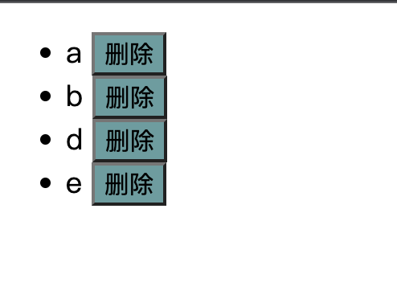
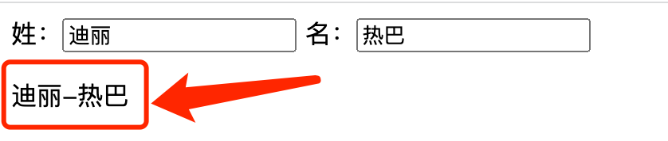

# 一、Vue 基础

## 1、 框架 前置

### 1.1 为什么要学习流行框架？

企业为了提高效率，时间就是金钱。

开发人员：提高了开发效率

```js
思考： 为什么 原生JS开发 不高效？

-> 举例： 点击 某个 DOM元素，但 要阻止冒泡：

  const box = document.querySelector(".box");

  // 考虑 浏览器的兼容性
  box.addEventListener("click", (e) => {
    // 事件对象 的 兼容性 写法：
    e = e || window.event;

    // 阻止 冒泡 - 阻止事件冒泡也 需要兼容性写法：
    e.stopPropagation(); // 阻止事件冒泡
    e.cancelBubble = true; // 阻止事件冒泡 的 兼容性写法

    console.log("点击了 box...");
  });
```

JS => JQuery => 框架时代（React、Vue）

- JS：原生 JS 直接操作 DOM 元素
- JQuery 库（流行事件 2005 年~2015 年）：提供的大量的**函数**简化操作 DOM 并且解决 DOM 操作的浏览器兼容性问题。
- 框架（Angular - 谷歌出品 - 现在国内几乎不使用了、React - Facebook 出品、Vue）：提供了一整套全新的、高效的前端开发方案：

### 1.3 前端框架与库的区别？

- 功能层面

  jquery 库：操作 DOM + 网络请求后端数据

  框架：提供全方位功能，齐全

  如果把库比作肯德基的小套餐的话，框架就类似于 KFC 的全家桶级别的。

- 代码层面

  库：是为了实现某个页面功能，而调用某个函数；

  框架：在框架**提供的自己语法**和规则下完成页面功能的开发

- 总结

  库：在 JS 的基础上，引入和使用库的各种函数；

  框架：大而沉，有自己完整的语法，相比库的学习成本更高，但开发效率也更高。

### 框架所提供的重要功能和特性：

- 如 **数据的响应式（数据驱动视图）**
- 组件化
- 渐进式
- ...

### 1.4 思考：前端的的主要工作内容？

```js
工作中：前端的主要工作内容？

-> 后端给咱前端数据，将后端给的数据，绘制到 页面中。
```

> ##### 01-原生 JS 如何将数据渲染在页面中.html
>
> ```html
> <script>
>   // 后端返回的数据：
>   const model = {
>     // 注：model 表示数据（data）
>     content: "千锋数字智慧大前端",
>   };
> </script>
>
> // 思考1：如何 使用 JS 将 model 中的数据，以下述形式 绘制到 视图（页面）中 //
> -> 使用 `render` 函数实现
> <div id="app">
>   <h1>${model.content}</h1>
> </div>
> ```
>
> ```html
> <script>
>   // 思考2：若 model 的数据发生改变，如何 将改变后的数据，更新至 视图（页面）中
>   //  -> 再执行一次 render 函数，（render 函数的 作用：根据 model 绘制页面）
>   const model = {
>     // 注：model 表示数据（data）
>     content: "数据被更新...",
>   };
> </script>
>
> <div id="app">
>   <h1>${model.content}</h1>
> </div>
>
> // 思考：上述JS操作缺点是什么？ -> 数据被改变了，需要 人工/手动 执行 render
> 函数。 - -> 不能自动执行，所以 非常麻烦。 // 理想状态，应该怎样？ // ->
> 数据被改变，自动 执行 render 函数； -> 上述的自动化的过程，即
> 「数据的响应式（数据驱动视图）」。
> ```

### 1.5 MVVM 架构模式（Vue 实现 数据响应式 的 设计模式）

目标：理解 MVVM 设计模式的思想 与 作用


MVVM 其实是指三部分：

- **M** 指的是：**M**odel 层 是数据模型，即用来存储后端返回的数据；
- **V** 指的是：**V**iew 层 是视图（即浏览器页面），展示 Model 层的数据。
- **VM** 指的是：**V**iew**M**odel(视图模型)，其同时监测 Model 层和 View 层，只要一方发生变化，则 VM 便会自动更改另一方；最终使两方的内容保持一致。

```vue
<script>
// Model 层
const model = {
  // 注：model 表示数据（data）
  content: "数据被更新...",
};
</script>

// View 层
<div id="app">
  <h1>${model.content}</h1>
</div>
```

##### 特性：

1. **数据驱动视图**

   好处：当 Model 层发生数据变化时，页面会自动重新渲染。开发人员只维护好数据的变化，页面结构会被 VM 会自动渲染出来。

2. 双向数据绑定

   举个栗子：当视图中有 <input /> 若其值发生变化，则 vm 会自动把最新的值取出来，更新到数据。

   好处：开发人员不再需要手动操作 DOM 元素，来获取表单元素输入的最新值；js 数据的变化，会被自动渲染到页面上。

Vue.js 是一个提供了 MVVM 风格的双向数据绑定的 Javascript 库，专注于 View 层。

 它的核心是 MVVM 中的 **VM**，也就是 ViewModel。

 ViewModel 负责连接 View 和 Model，保证视图和数据的一致性，这种轻量级的架构让前端开发更加高效、便捷。

## 2、Vue 介绍

### 2.1 简介

Vue 是一个国产框架，之前所学的 JQuery 库、Bootstrap，基本都诞生于国外。像 Vue 这种优秀的国产框架少之又少，它的作者是国内大神—尤雨溪。


Vue (读音 /vjuː/，类似于 view) 是一套用于构建用户界面的**渐进式框架**。与其它大型框架不同的是，Vue 被设计为可以自底向上逐层应用。**Vue** **的核心库只关注视图层**，不仅易于上手，还便于与第三方库或既有项目整合。另一方面，当与现代化的工具链以及各种支持类库结合使用时，Vue 也完全能够为复杂的单页应用提供驱动。


**兼容性**：**Vue 不支持 IE8 及以下版本**，因为 Vue 使用了 IE8 无法模拟的 ECMAScript 5 特性。但它支持所有兼容 ECMAScript 5 的浏览器。

**IE：它是一个用来下载其他浏览器的好工具**


### 2.2 市场地位

Vue.js 是前端的**主流框架之一**，和 Angular.js、React.js 一起，并成为前端三大主流框架！

- React 和 Vue 有许多相似之处，它们都有：

  - 使用 Virtual DOM
  - 提供了 响应式 (Reactive) 和 组件化 (Composable) 的视图组件。
  - 将注意力集中保持在核心库，而将其他功能如路由和全局状态管理交给相关的库。

- Vue.js 的优点：

  1. 体积小，压缩后只有 33kb

  2. 更高的运行效率，基于虚拟 dom 原理。

     一种可以预先通过 JavaScript 进行各种计算，把最终的 DOM 操作计算出来并优化的技术，由于这个 DOM 操作属于预处理操作，并没有真实的操作 DOM，所以叫做虚拟 DOM。

  3. 双向数据绑定原理。

     让开发者不用再去操作 dom 对象，把更多精力投入到业务逻辑上

  4. 生态丰富、学习成本低。

     市面上成熟、稳重的基于 vue.js 的 UI 框架、常用组件多。

     基于以上原因，Vue.js 对初学者友好，容易上手。国内中小企业用的较多。

### 2.3 Vue2 和 Vue3

- \*\* Vue2 官网：https://v2.cn.vuejs.org/
- Vue3 官网：https://cn.vuejs.org/
- 授课路线：先 vue2 再 vue3
  - Vue2 的编程范式(风格)：典型的 面向对象 -> `new 构造函数()`
  - Vue3 的编程范式(风格)：面向对象 + 面向函数

## 3、Vue 初体验

### 3.1 Vue 使用方式

- 方式一：直接 CDN 引入

  以选择引入开发环境版本还是生产环境版本

  ```html
  <!-- 开发环境版本，包含了有帮助的命令行警告 -->
  <script src="https://cdn.jsdelivr.net/npm/vue/dist/vue.js"></script>
  <!-- 生产环境版本，优化了尺寸和速度 -->
  <script src="https://cdn.jsdelivr.net/npm/vue"></script>
  ```

- 方式二：下载并引入（**==初学者推荐==**）

  开发环境 ：https://v2.cn.vuejs.org/js/vue.js

  生产环境 ：https://v2.cn.vuejs.org/js/vue.min.js

### 3.2 Vue 基本使用

Vue.js 的 html 代码写法，是一个允许采用简洁的 模板语法 来声明式地将数据渲染进 DOM 的系统。

```html
<div id="app">
  <h1>{{content}}</h1>
</div>
```

每个 Vue 应用都是通过用 `Vue` 函数创建一个新的 **Vue 实例**开始的：

```javascript
const vm = new Vue({
  // Vue实例
  el: "#app", //目的地，挂载点
  data: {
    //数据
    content: "千锋数字智慧大前端",
  },
});
```

我们已经成功创建了第一个 Vue 应用！

看起来这跟渲染一个字符串模板非常类似，但是 Vue 在背后做了大量工作。

现在数据和 DOM 已经被建立了关联，所有东西都是**响应式的**。

```vue
// 我们要怎么确认呢？
```

> ##### 01.vue 初体验.html
>
> ```html
> <!DOCTYPE html>
> <html lang="en">
>   <head>
>     <meta charset="UTF-8" />
>     <meta http-equiv="X-UA-Compatible" content="IE=edge" />
>     <meta name="viewport" content="width=device-width, initial-scale=1.0" />
>     <title>Document</title>
>   </head>
>   <body>
>     <div id="app">
>       <h1>{{content}}</h1>
>     </div>
>   </body>
> </html>
> <script src="./vue.js"></script>
> <script>
>   var vm = new Vue({
>     // Vue实例
>     el: "#app", //目的地，挂载点
>     data: {
>       //数据
>       content: "千锋数字智慧大前端",
>     },
>   });
> </script>
> ```

#### 总结：

1. 引入 vue.js
2. 在 body 中创建一个挂载点
3. new Vue，挂载到挂载点上

> 使用 vue 的第一个好处：但凡 data 中声明的 属性 均可被挂载到 `{{  }}` 中，且 data 中的属性具有 **数据的响应式** 。

### 3.3 开发者工具

在使用 Vue 时，我们推荐在你的浏览器上安装 **Vue Devtools**。它允许你在一个更友好的界面中审查和调试 Vue 应用

##### 安装 chrome 插件的方式：


##### devtools 不显示处理方式：


## 4、模板语法

 Vue.js 使用了基于 HTML 的模板语法 -> “Mustache”语法，胡须 - 被俗称为 **「大胡子」**

 模板语法的作用：new Vue 下很多 JS 数据可以直接在 模板语法中被使用 -> 如 data 中的属性，且 模板语法中的数据具有响应性。

数据绑定最常见的形式就是使用“Mustache”语法 (双大括号) 的文本插值：

```html
<div id="app">{{ message }}</div>
```

```js
var vm = new Vue({
  el: "#app",
  data: {
    message: "Hello Vue!",
  },
});
```

效果：

 

#### 4.1 {{ 表达式 }} 可以放什么？

- data 中的 任意数据类型

```vue
- 数组 - 对象
```

- 表达式
  - 什么是 表达式？

```vue
-> ['a', 'b', 'c'].map(d => d + '1'); // 也是表达式 -> 123 + 111 // 也是表达式
```

> 06-模板语法的作用：可以写表达式
>
> ```vue
> <!DOCTYPE html>
> <html lang="en">
>   <head>
>     <meta charset="UTF-8" />
>     <meta http-equiv="X-UA-Compatible" content="IE=edge" />
>     <meta name="viewport" content="width=device-width, initial-scale=1.0" />
>     <title>Document</title>
>   </head>
>   <body>
>     <!-- 注：其 双花括号的代码，不生效 -->
>     <p>{{ content }}</p>
>     <div id="app">
>       <h1>{{ content }} - {{ message }}</h1>
>       <p>数组：{{ arr }}</p>
>       <p>对象：{{ obj }}</p>
>       <p>表达式 - 数组的map方法：{{ arr.map((d) => d + "1") }}</p>
>       <p>数字相加的表达式 {{ 11 + 22 }}</p>
>     </div>
>   </body>
> </html>
> <script src="../packages/vue.js"></script>
> <script>
> const vm = new Vue({
>   // `el` 指的是 `<div id="app">` 的 DOM元素
>   el: "#app", // 将 vue 的代码 生效的「挂载点」
>   data: {
>     // model
>     //数据
>     content: "千锋数字智慧大前端",
>     message: "Hello Vue!",
>     arr: ["a", "b", "c"],
>     obj: {
>       name: "姓名",
>       age: 33,
>     },
>   },
> });
> </script>
> ```

## 5、指令语法

```vue
// 概念约定： 标签的属性：属性名、 标签的属性值 分别的英文 和 简写

<div title="xxx">
  <!-- 
		title 被称为：「属性名」
			->  英文 和 简写： attribute
				-> attrName

		'xxx' 被称为：「属性值」
			-> 英文 和 简写
				->  attrValue
	-->
  
</div>
```

vue 中定义好的一些以"v-"开头+具体的名称的 属性，这些属性都有特定的功能。

- 说明

  指令加在标签，在 Vue 中凡是以 `v-` 开头的都叫做「指令」，加上就会有特定的功能。

- 常见用法

  ```html
  <div v-xx></div>
    
  <div v-xx="表达式 或 data中的属性"></div>
  <div v-xx:yy="表达式"> </div>
  ```

- 注意

  指令分：自定义指令和内置指令（Vue 自带）

 内置指令：Vue 自带 的，能直接使用的 指令

 自定义指令：就是用户自己定义的。扩展功能

下述列举 常用的 内置指令：

### 5.1 文本绑定

#### v-html、v-text

双大括号会将数据解释为普通文本，而非 HTML 代码。为了输出真正的 HTML，需要用到 v-html

```html
<p>Using mustaches: {{ rawHtml }}</p>
<p>Using v-html directive: <span v-html="rawHtml"></span></p>
<!-- v-text -->
<p>Using v-text directive: <span v-text="rawHtml"></span></p>
```

#### v-cloak

cloak ：[kləuk] 笼罩，覆盖；隐藏，掩饰的意思

用于隐藏尚未完成编译的 DOM 模板。 {{}}

当使用直接在 DOM 中书写的模板时，可能会出现一种叫做“未编译模板闪现”的情况：用户可能先看到的是还没编译完成的双大括号标签，直到挂载的组件将它们替换为实际渲染的内容。

`v-cloak` 会保留在所绑定的元素上，直到相关组件实例被挂载后才移除。配合像 `[v-cloak] { display: none }` 这样的 CSS 规则，它可以在组件编译完毕前隐藏原始模板。

```html
<style>
  [v-cloak] {
    display: none;
  }
</style>

<!-- 直到编译完成前，`<div>` 将不可见。 -->
<div v-cloak>{{ message }}</div>
```

#### v-pre

元素内具有 `v-pre`，所有 Vue 模板语法都会被保留并按原样渲染。最常见的用例就是显示原始双大括号标签及内容。

```html
<div v-pre>{{ rawHTML }}</div>
```

> 07-vue 中常见的指令.html
>
> ```vue
> <!DOCTYPE html>
> <html lang="en">
>   <head>
>     <meta charset="UTF-8" />
>     <meta http-equiv="X-UA-Compatible" content="IE=edge" />
>     <meta name="viewport" content="width=device-width, initial-scale=1.0" />
>     <title>Document</title>
>     <style>
>       [v-cloak] {
>         display: none;
>       }
>     </style>
>   </head>
>   <body>
>     <div id="app">
>       <!-- 注： {{}} 需要被 vue 解析，所以 刷新的 瞬间 `{{}}` 会闪现，因为 vue 还没将 {{}} 解析完成 -->
>       <!-- 注：v-cloak 作用：解决 刷新时的 闪现问题 -->
>       <h1 v-cloak>{{ content }} - {{ message }}</h1>
>
>       <!-- v-pre 的作用：组织 vue 解析 大胡子中的 表达式 -->
>       <h1 v-pre>{{ content }} - {{ message }}</h1>
>
>       <!-- v-html 其作用 等价于 `innerHTML` -->
>       <div v-html="rawHtml"></div>
>
>       <!-- v-html 其作用 等价于 `innerText` -->
>       <div v-text="rawHtml"></div>
>     </div>
>   </body>
> </html>
> <script src="../packages/vue.js"></script>
> <script>
> const vm = new Vue({
>   el: "#app", // 将 vue 的代码 生效的「挂载点」
>   data: {
>     // model
>     //数据
>     content: "千锋数字智慧大前端",
>     message: "Hello Vue!",
>     rawHtml: `<p>我是 字符串的 p 文本</p>`,
>   },
> });
> </script>
> ```

### 5.2 属性绑定 - `v-bind`

思考：若 给标签的 属性值 也能像 `{{ 表达式 }}` 一样，具有响应性，岂不美哉...

-> 而 `v-bind:attrName="表达式"` 就是 为了 实现 标签属性的 响应性的

- v-bind 的简写方式： `:attrName="表达式"` 其是 `v-bind:attrName="表达式"` 的简写形式。

> 绑定属性.html
>
> ```vue
> <!DOCTYPE html>
> <html lang="en">
>   <head>
>     <meta charset="UTF-8" />
>     <meta http-equiv="X-UA-Compatible" content="IE=edge" />
>     <meta name="viewport" content="width=device-width, initial-scale=1.0" />
>     <title>Document</title>
>   </head>
>   <body>
>     <div id="app">
>       <!-- 注： 使用 `v-bind` 指定，可以使得 attrValue 也能使用「表达式」 -->
>       <a v-bind:href="link">{{ title }}</a>
>
>       <!-- v-bind 的简写形式 -->
>       <h1 :title="title">{{ title }}</h1>
>     </div>
>   </body>
> </html>
> <script src="../packages/vue.js"></script>
> <script>
> const vm = new Vue({
>     el: "#app", // 将 vue 的代码 生效的「挂载点」
>     data: {
>       link: "http://www.baidu.com",
>       title: "百度一下",
>     },
> });
> </script>
> ```

#### 5.2.1 动态绑定类属性

操作元素的 class 列表和内联样式是数据绑定的一个常见需求。

但字符串拼接 class 和 style ，操作麻烦且容易出错。

因此，在将 v-bind 用于 class 和 style 时，Vue.js 做了专门的增强。

表达式结果的类型除了字符串之外，还可以是**对象**或**数组**。

```vue
<!DOCTYPE html>
<html lang="en">
  <head>
    <meta charset="UTF-8" />
    <meta http-equiv="X-UA-Compatible" content="IE=edge" />
    <meta name="viewport" content="width=device-width, initial-scale=1.0" />
    <title>Document</title>
    <style>
      .box {
        width: 100px;
        height: 100px;
        background-color: pink;
      }

      .bold {
        font-weight: 900;
      }
    </style>
  </head>
  <body>
    <div id="app">
      <!-- vue 的 v-bind，对 class 和 style 做了优化：
        其可以是 字符串，也可以是 「对象」和「数组」！  
      -->

      <!-- class 可以是 对象，若 对象的 key 的 value 是 true，则 该 DOM 有 className 为 key 的 class -->
      <div v-bind:class="{ box: flag, bold: true }">对象方式</div>

      <!-- class 的数组写法：类比为 DOM.classList
        注： class 为 数组的时候，此种写法 非常常用！！！
      -->
      <div :class="['box', isBold ? 'bold' : '']">数组形式的 class</div>
    </div>
  </body>
</html>
<script src="../packages/vue.js"></script>
<script>
const vm = new Vue({
  el: "#app", // 将 vue 的代码 生效的「挂载点」
  data: {
    flag: true,
    isBold: true,
  },
});
</script>
```

##### 注意：

==在 vue 当中 静态 class 和 动态绑定 class 可以同时存在==

```vue
<!-- 注意：在vue 当中 静态class和动态绑定class可以同时存在 -->
<div class="title" v-bind:class="{ box: flag, size: 3 > 2 }">对象方式</div>
```

#### 5.2.2 动态绑定 style 属性

- 对象语法

  `v-bind:style` 的对象语法十分直观——看着非常像 CSS，但其实是一个 JavaScript 对象。CSS property 名可以用驼峰式 (camelCase) 或短横线分隔 (kebab-case，记得用引号括起来) 来命名：

  ```html
  <div v-bind:style="{ color: activeColor, fontSize: fontSize + 'px' }"></div>
  ```

  ```js
  data: {
    activeColor: 'red',
    fontSize: 30
  }
  ```

- 数组语法

  `v-bind:style` 的数组语法==可以将多个样式对象==应用到同一个元素上：

  ```html
  <div v-bind:style="[baseStyles, overridingStyles]"></div>
  ```

  > style 的用法.html
  >
  > ```html
  > <!DOCTYPE html>
  > <html lang="en">
  >   <head>
  >     <meta charset="UTF-8" />
  >     <meta http-equiv="X-UA-Compatible" content="IE=edge" />
  >     <meta name="viewport" content="width=device-width, initial-scale=1.0" />
  >     <title>Document</title>
  >   </head>
  >   <body>
  >     <div id="app">
  >       <!-- style 是 对象 的写法 更常用！！！ -->
  >       <div v-bind:style="{ color: 'red', fontSize: fontSize }">
  >         对象方式
  >       </div>
  >
  >       <div :style="[baseStyles, overridingStyles]">数组的写法</div>
  >     </div>
  >   </body>
  > </html>
  > <script src="../packages/vue.js"></script>
  > <script>
  >   const vm = new Vue({
  >     el: "#app", // 将 vue 的代码 生效的「挂载点」
  >     data: {
  >       fontSize: "50px",
  >       baseStyles: {
  >         color: "blue",
  >         fontSize: 15,
  >       },
  >       overridingStyles: {
  >         background: "black",
  >         color: "white", // 注： 数组中的 对象，其 属性 若发生了 重复，则 后面的 会 覆盖前面的属性
  >       },
  >     },
  >   });
  > </script>
  > ```


<hr />

### 预讲：事件简介

```vue
<button @事件类型="赋值语句"></button>
```


<hr />


### 5.3 条件渲染

原生 js : 条件分支  if 判断

```js
if(true){
    //....
}else if(){

}else if(){

}else{

}
```

在 Vue 当中，条件渲染用 v-if、v-else-if、v-else、v-show。

#### 5.3.1 v-if

`v-if` 指令用于条件性地渲染一块内容。这块内容只会在指令的表达式返回 true 的时候被渲染

```html
<h1 v-if="awesome">Vue is awesome!</h1>
```

也可以用 `v-else` 添加一个“else 块”：

```html
<h1 v-if="awesome">Vue is awesome!</h1>
<h1 v-else>Oh no</h1>
```

**在 template 上使用**

因为 `v-if` 是一个指令，所以必须将它添加到一个元素上。但是如果想切换多个元素呢？此时可以把一个 `<template>` 元素当做==不可见的包裹元素==，并在上面使用 `v-if`。最终的渲染结果将不包含 `<template>` 元素。 只起包裹作用

```html
<template v-if="ok">
  <h1>Title</h1>
  <p>Paragraph 1</p>
  <p>Paragraph 2</p>
</template>
```

#### 5.3.2 v-else

你可以使用 `v-else` 指令来表示 `v-if` 的“else 块”：

```html
<div v-if="flag">Now you see me</div>
<div v-else>Now you don't</div>
```

`v-else` 元素必须紧跟在带 `v-if` 或者 `v-else-if` 的元素的后面，否则它将不会被识别。

`v-else-if`，顾名思义，充当 `v-if` 的“else-if 块”，可以连续使用：

```html
<div v-if="type === 'A'">A</div>
<div v-else-if="type === 'B'">B</div>
<div v-else-if="type === 'C'">C</div>
<div v-else>Not A/B/C</div>
```

#### 5.3.3 v-show

另一个用于根据条件展示元素的选项是 `v-show` 指令。用法大致一样：

```vue
<h1 v-show="ok">Hello!</h1>
```

不同的是带有 `v-show` 的元素始终会被渲染并保留在 DOM 中。`v-show` 只是简单地切换元素的 CSS property `display`

**v-if 与 v-show 比较**

- 渲染模式：v-if 控制DOM元素的 销毁与创建； v-show 是控制 css 的 display。
- 开销/性能：v-if 因为需要 销毁和创建，而 v-show 只是控制 display 的 css，所以 v-show 对性能开销更低。
- 如何选择：
  - 若是要控制大量元素的显示与隐藏，v-if开销更大，不建议使用。
  - 但 若要有 条件分支的逻辑：if - else / if - else ... if，只能用 v-if；因为 v-show 没有其他的 v-else 的逻辑。

#### 总结：

1. 语法：

   ```vue
   <div v-if='条件1'>条件1成立</div>
   <div v-else-if='条件2'>条件2成立</div>
   <div v-else>条件1，2都不成立</div>
   ```

2. v-if 功能：添加、删除元素；切换频率不高，用v-if


3. v-else-if 、v-else 要配合 v-if 一起使用，不能单独使用

4. v-show 语法:

   ```vue
   <div v-show='条件'>显示</div>
   ```

5. 特点：控制元素的display属性是否none；切换比较频繁，建议使用v-show

   应用场景：切换开销比较高就用 v-show


### 5.4 列表渲染

原生JS  遍历数组  for 


我们可以用 `v-for` 指令基于一个数组来渲染一个列表。`v-for` 指令需要使用 `item in items` 形式的特殊语法，其中 `items` 是源数据数组，而 `item` 则是被迭代的数组元素的**别名**。

```html
<ul id="app">
  <li v-for="item in items" :key="item.name">
    {{ item.name }}
  </li>
</ul>

```

```js
var example1 = new Vue({
  el: '#app',
  data: {
    items: [
      { name: '千千' },
      { name: '小峰' }
    ]
  }
})
```


>嵌套渲染
>
>```vue
><!DOCTYPE html>
><html lang="en">
>  <head>
>    <meta charset="UTF-8" />
>    <meta http-equiv="X-UA-Compatible" content="IE=edge" />
>    <meta name="viewport" content="width=device-width, initial-scale=1.0" />
>    <title>Document</title>
>  </head>
>  <body>
>    <ul id="app">
>      <li v-for="item in items">
>        {{item.name}}
>        <ol>
>          <li v-for="child in item.children">{{child.name}}</li>
>        </ol>
>      </li>
>    </ul>
>  </body>
></html>
><script src="../packages/vue.js"></script>
><script>
>  const vm = new Vue({
>    el: "#app",
>    data: {
>      items: [
>        {
>          name: "aa",
>          children: [
>            { name: "aa - 1" },
>            { name: "aa - 2" },
>            { name: "aa - 3" },
>          ],
>        },
>        {
>          name: "bb",
>          children: [
>            { name: "bb - 1" },
>            { name: "bb - 2" },
>            { name: "bb - 3" },
>          ],
>        },
>      ],
>    },
>  });
></script>
>
>```
>
>


##### 作业：嵌套列表渲染


## 6、事件处理

### 前置知识：

1. Vue2 典型的面向对象写法

2. Vue的 函数 - methods

   注：因为 vue 是「面向对象」写法，所以 函数中，可以使用 `this`。


### 6.1 监听事件 - 基础写法：

注：（vue 的事件绑定，一共三种写法）

可以用 `v-on` 指令监听 DOM 事件，并在触发时运行一些 JavaScript 代码。

- 语法：

```html
<div id="example-1">
  <button v-on:click="counter += 1">Add 1</button>
  <p>The button above has been clicked {{ counter }} times.</p>
</div>
```

```js
var example1 = new Vue({ 
    el: '#example-1',
    data: {  
        counter: 0 
    } 
})
```

​	


- 事件绑定的简写：

`v-on:click = "JS语句"` 的简写方式： `@click = "JS语句"`


### 6.2 事件 触发 回调函数

```html
<div id="example-2">  
    <!-- `greet` 是在下面定义的方法名 -->  
    <button v-on:click="greet">Greet</button>
</div>
```

```js
var example2 = new Vue({
  el: '#example-2',
  data: {
    name: 'Vue.js'
  },
  // 在 `methods` 对象中定义方法
  methods: {
    greet: function (event) {
      // `this` 在方法里指向当前 Vue 实例
      alert('Hello ' + this.name + '!')
      // `event` 是原生 DOM 事件
      if (event) {
        alert(event.target.tagName)
      }
    }
  }
})

```


### 6.3 事件传递参数

```html
<div id="example-3">
  <button v-on:click="say('hi')">Say hi</button>
  <button v-on:click="say('what')">Say what</button>
</div>
```

```js
new Vue({
  el: '#example-3',
  methods: {
    say: function (message) {
      alert(message)
    }
  }
})
```


##### 小结：

事件相关：1、this 指向   2、传参  3、事件对象


1. this 指向： 指向当前 vm实例对象

2. 传参：  ` v-on:click="say('Hi')"`

3. 事件对象：

   不带参数:接受到的第一个参数就是事件对象 

   带参数：又要用事件对象时，必须写成$event！！！！！


### 6.4 事件修饰符（本质 就是 一些 “快捷键”）

在事件处理程序中调用 `event.preventDefault()` 或 `event.stopPropagation()` 是非常常见的需求。尽管我们可以在方法中轻松实现这点，但更好的方式是：方法只有纯粹的数据逻辑，而不是去处理 DOM 事件细节。

为了解决这个问题，Vue.js 为 `v-on` 提供了**事件修饰符**。之前提过，修饰符是由点开头的指令后缀来表示的。

#### 6.4.1 事件修饰符

- `.stop` 阻止事件事件冒泡
- `.prevent`  阻止浏览器的默认行为
- `.capture` 开启 捕获模式
- `.self`
- `.once`
- .passive

```html
<!-- 阻止单击事件继续传播 -->
<a v-on:click.stop="doThis"></a>

<!-- 提交事件不再重载页面 -->
<form v-on:submit.prevent="onSubmit"></form>

<!-- 修饰符可以串联 -->
<a v-on:click.stop.prevent="doThat"></a>

<!-- 只有修饰符 -->
<form v-on:submit.prevent></form>

<!-- 添加事件监听器时使用事件捕获模式 -->
<!-- 即内部元素触发的事件先在此处理，然后才交由内部元素进行处理 -->
<div v-on:click.capture="doThis">...</div>

<!-- 只当在 event.target 是当前元素自身时触发处理函数 -->
<!-- 即事件不是从内部元素触发的 -->
<div v-on:click.self="doThat">...</div>
```

#### 


```vue
<!-- 案例： 阻止冒泡  和  阻止浏览器的默认行为 -->
<style>
  * {
    margin: 0;
    padding: 0;
  }
  body,
  div {
    display: flex;
    justify-content: center;
    align-items: center;
  }
  .blue {
    width: 300px;
    height: 300px;
    background-color: blue;
  }
  .green {
    width: 200px;
    height: 200px;
    background-color: green;
  }
  .red {
    width: 100px;
    height: 100px;
    background-color: red;
  }
</style>

<div id="app">
  <div class="blue" @click.stop="handleClickBlue">
    <div class="green" @click.stop="handleClickGreen">
      <div
           class="red"
           @click.stop="handleClickRed"
           @contextmenu="handleContextMenuRed"
           ></div>
    </div>
  </div>
</div>
```

#### 6.4.2 按键修饰符

在监听键盘事件时，我们经常需要检查详细的按键。Vue 允许为 `v-on` 在监听键盘事件时添加按键修饰符：

.enter
.tab
.delete (捕获“删除”和“退格”键)
.esc
.space
.up
.down
.left
.right

```html
<input v-on:keyup.enter="submit">
```

#### 6.4.3 系统修饰键

可以用如下修饰符来实现仅在按下相应按键时才触发鼠标或键盘事件的监听器。

- `.ctrl`
- `.alt`
- `.shift`
- `.meta`  windows 下，指的是 windows键；macos下，指的是 command 键；

```html
<!-- Alt + C -->
<input v-on:keyup.alt.67="clear">

<!-- Ctrl + Click -->
<div v-on:click.ctrl="doSomething">Do something</div>
```


### 6.5 案例：点击高亮

要求：

1. 动态渲染列表
2. 点谁高亮，谁高亮


### 6.6 案例：点击删除按钮，删除对应行

1. 动态渲染列表
2. 点击删除按钮，删除对应的li标签




### 6.6 v-for一定要绑定key属性

#### v-for 为什么一定要绑定key?

> 有相同父元素的子元素必须有**独特的 key**。重复的 key 会造成渲染错误。

https://v2.cn.vuejs.org/v2/api/#key

##### 结论：

设置key的目的，就是为了让列表中当前节点得到复用。像vue、react、还有小程序当中，只要用了遍历，生成同样结构的数据，必须要给每个结构加一个唯一性的标识。


#### 为什么需要「虚拟DOM」？

数据渲染到界面要经历创建虚拟DOM的过程，才能真正上DOM树。

1. 真实DOM太重，属性太多。虚拟DOM轻。
2. 新旧虚拟DOM之间的对比，效率更高。


**虚拟Dom**：是真实Dom的映射，即用 JS 对象来描述真实DOM节点，本质上就是在 JS 和 DOM 之间做了一个缓存。

真实DOM：

```vue
<ul id='list'>
    <li class='item'>aa</li>
    <li class='item'>bb</li>
    <li class='item'>cc</li>
</ul>
```

虚拟DOM：

```js
{
    tagName:'ul',//节点标签名
    props:{//dom的属性，用一个对象存储键值对
        id:'list'
    },
    children:[//该节点的子节点
        {tagName:'li',props:{class:'item'},children:['aa']}，
        {tagName:'li',props:{class:'item'},children:['bb']},
        {tagName:'li',props:{class:'item'},children:['cc']}
    ]
}
```

别名：vdom、vnode、virtual dom、virtual node


**diff 算法**：比较两棵虚拟 DOM 树的差异，最小量变化

**patch**：将两个虚拟 DOM 对象的差异应用到真正的 DOM 树。


#### 为什么key属性最好不要用下标

- 若使用了 下标，其 效果 `:key` 作为 唯一标识的效果，就丧失了。


#### 总结：          

1. 列表渲染一定要绑定key！！！！
2. 设置key的目的，就是为了让列表中当前节点得到复用（提高性能）
3. 原则：尽量不要用下标，用后台提供的唯一标识！


## 7、表单输入绑定

回顾：前面我们讲过从data数据到页面的单向绑定，用到v-bind，如果要实现双向绑定，就用到了接下来要讲的 v-model。

### 7.1 v-model

`v-model`  ：可以实现表单元素和Model层中的数据的双向绑定，特点注意：==只能应用在表单类元素单中！==

​		你可以用 `v-model` 指令在表单元素创建双向数据绑定。它会根据控件类型自动选取正确的方法来更新元素。尽管有些神奇，但 v-model 本质上不过是语法糖。它负责监听用户的输入事件以更新数据，并对一些极端场景进行一些特殊处理。

`v-model` 在内部为不同的输入元素使用不同的 property 并抛出不同的事件：

- text 和 textarea 元素使用 `value` property 和 `input` 事件；
- checkbox 和 radio 使用 `checked` property 和 `change` 事件；
- select 字段将 `value` 作为 prop 并将 `change` 作为事件。

你可以用 v-model 指令在表单控件元素上创建双向数据绑定

​	

==v-model 默认收集的是表单元素中 value 的值==


#### 案例：==自动==收集表单数据


```vue

```


### 7.2 ref 来获取表单中的数据

- 说明

  给DOM元素或组件起名字，相当于 id 标记，通过：this.$refs.名字 获取给Dom元素

- 语法

  ```html
  <input type='text' ref='userInfo' />  <!--相当于给input框取个名字，相当于id-->
  
  // JS 代码，在函数中 ，获取到 对应的 DOM 元素
  // 再次强调：Vue 中，切记，不要直接操作DOM元素；则 不要 document.querySelector()...
  // 因为 vue/react 的思想，都是 「数据驱动视图」，即考虑如何操作数据，而不是操作DOM元素。
  
  this.$refs.userInfo 
  ```

- 应用

  获取Dom节点;

  修改DOM节点相关属性
  
  - 注：不建议直接操作DOM元素


### 7.3 修饰符

.**lazy**

在默认情况下，`v-model` 在每次 `input` 事件触发后将输入框的值与数据进行同步 (除了[上述](https://cn.vuejs.org/v2/guide/forms.html#vmodel-ime-tip)输入法组合文字时)。你可以添加 `lazy` 修饰符，从而转为在 `change` 事件_之后_进行同步：

```html
<!-- 
	在“change”时而非“input”时更新 
		即，光标丢失 且value内容发生了改变，才会触发 change 事件
-->
<input v-model.lazy="msg">
```


.**number**

如果想自动将用户的输入值转为数值类型，可以给 `v-model` 添加 `number` 修饰符：

```html
<input v-model.number="age" type="number">
```

这通常很有用，因为即使在 `type="number"` 时，HTML 输入元素的值也总会返回字符串。如果这个值无法被 `parseFloat()` 解析，则会返回原始的值。


.**trim**

如果要自动过滤用户输入的首尾空白字符，可以给 `v-model` 添加 `trim` 修饰符：

```html
<input v-model.trim="msg">
```


### 7.4 v-model实现的原理

v-model只不过是一个语法糖而已,真正的实现靠的还是

原理：      

1、通过v-bind，动态绑定value属性      

2、监听input事件，把变化后的值赋值给变量

v-model 是什么。语法糖 :value + @input。还要分为两种情况


##### 

## 8、数据劫持与代理

### Object.defineProperty()

Vue2 中很多地方都用到了它，比如说Vue中的 数据劫持、数据代理、计算属性 等都用到了这个方法。

https://developer.mozilla.org/zh-CN/docs/Web/JavaScript/Reference/Global_Objects/Object/defineProperty

作用：为 对象 添加 或者 修改属性，使之变为==响应式的==。  数据劫持，拦截了做点儿啥事儿。

#### Object.defineProperty - 基本用法

```js
  const data = {
    content: "你好",
  };

  Object.defineProperty(data, "key1", {
    value: "即表示给 key1 的value 值", // 作用：给 key1 增加 属性值
    enumerable: true, // enumerable - 即是否可被 for...in 循环遍历（默认值是 false）
    writable: true, // writable - 即 该key 的value值能否被修改（默认值是 false）
    configurable: true, // configurable - 即 该key 能否被 `delete` 将该 key 删除（默认值是 false）
  });
```

```js
  // 声明的 对象 - Model（数据）
  const data = {
    content: "你好",
    age: 333,
  };


  const vm = {}; // 表示 vm 的实例对象

  Object.defineProperty(vm, "age", {
    // 注：defineProperty 的对象，还有 两项 配置项：get函数 和 set函数
    get() {
      // get 函数 ，又被称为 `getter`，get 不能与 `value` 共用
      // 注：该函数的作用： 只要执行 `vm.age` 表示 查询该key的 value
      // 则 `vm.age` 的返回值是 本 get 函数的`返回值`
      console.log("vm - age 的 get 函数执行 了...");
      return data.age;
    },
    set(val) {
      // set 函数，又被称为 `setter`，set 不能与 `writable` 共用
      // 只要执行了 `vm.age = 新的value值`，即表示 data 的数据要被更新
      // 注：该函数的作用： 只要执行 `vm.age = 新的value值`，即赋值
      // 则会执行 set 函数，val 代表的是 `新的value值`

      console.log("vm - age 的 set 函数执行了 ...", val);
      data.age = val; // 数据被更新
    },
  });

```


### 案例：使属性变成响应式

```vue
<!DOCTYPE html>
<html lang="en">
  <head>
    <meta charset="UTF-8" />
    <meta http-equiv="X-UA-Compatible" content="IE=edge" />
    <meta name="viewport" content="width=device-width, initial-scale=1.0" />
    <title>Document</title>
    <style></style>
  </head>
  <body>
    <div id="app"></div>
  </body>
</html>
<script src="../packages/vue.js"></script>
<script>
  function render() {
    document.querySelector("#app").innerHTML = `
      <h1>${vm.msg}</h1>
      <h1>${vm.content}</h1>
    `;
  }

  const data = {
    msg: "你好",
    content: "千锋",
  };

  function createVm(data) {
    const vm = {};

    for (const key in data) {
      Object.defineProperty(vm, key, {
        get() {
          return data[key];
        },
        set(val) {
          data[key] = val;
          render();
        },
      });
    }

    return vm;
  }

  const vm = new createVm(data);

  render();
</script>

```


提示：Vue2使用Object.defineProperty() 无法给 对象中新增的key 实现数据的响应性


## 9、计算属性

案例：显示反转字符串

```vue
<div id="example">
  <!-- 将 message 字符串反转 -->
  <h1>{{ message.split('').reverse().join('') }}</h1>
</div>
```

上述写法（大胡子中的表达式写过多业务逻辑）的缺点：

在这个地方，模板不再是简单可读的代码。你必须看一段时间才能意识到（代码的可读性差），这里是想要显示变量 `message` 的翻转字符串。当你想要在模板中的多处包含此翻转字符串时，就会更加难以处理。

所以，对于任何复杂数据处理逻辑，你都应当使用**计算属性**。

**例子**

```html
<div id="example">
  <p>Original message: "{{ message }}"</p>
  <p>Computed reversed message: "{{ reversedMessage }}"</p>
</div>
```

```js
var vm = new Vue({
  el: '#example',
  data: {
    message: 'Hello'
  },
  computed: {
    // 计算属性的 的简写getter
    reversedMessage() {
      // `this` 指向 vm 实例
      return this.message.split('').reverse().join('')
    }
  }
})
```


### 计算属性总结

- 作用：由计算得来的属性。当你需要一个属性，不需要在data中提前声明，而是由其他现有属性计算得到（对**data中的属性进行再处理**）。

- 特点：是基于它的依赖而进行缓存。依赖变了，计算属性就重新计算;依赖不变，计算属性就不变。

- 应用场景：
  - 只要是需对data 中的数据进行“二次加工”即可选择计算属性


### 计算属性 VS 方法

- 方法不存在缓存。调用几次方法，就执行几次方法，每次调用都执行

### 

### 案例：



> ##### 14.方法和计算属性.html
>
> ```vue
> <!DOCTYPE html>
> <html lang="en">
>   <head>
>     <meta charset="UTF-8" />
>     <meta http-equiv="X-UA-Compatible" content="IE=edge" />
>     <meta name="viewport" content="width=device-width, initial-scale=1.0" />
>     <title>Document</title>
>     <style></style>
>   </head>
>   <body>
>     <div id="app">
>       姓：<input type="text" v-model="firstName" /> 名：<input
>         type="text"
>         v-model="lastName"
>       />
> 
>       <!-- 第一种方式 1、字符串拼接 【不用】 -->
>       <p>1.字符串拼接： {{firstName}}-{{lastName}}</p>
> 
>       <!-- 第二种方式 2、方法 【不用】 -->
>       <p>2.函数： {{fGetFullName()}}</p>
> 
>       <p>3.计算属性：{{fullName2}}</p>
>     </div>
>   </body>
> </html>
> <script src="../packages/vue.js"></script>
> <script>
>   const vm = new Vue({
>     el: "#app",
>     data: {
>       firstName: "姓",
>       lastName: "名",
>     },
>     methods: {
>       fGetFullName() {
>         return this.firstName + `-` + this.lastName;
>       },
>     },
> 
>     // 计算属性，是基于它的依赖而变化的。
>     computed: {
>       // 完整写法：
>       fullName: {
>         get() {
>           console.log("执行了 getter 函数");
>           return this.firstName + `-` + this.lastName;
>         },
>         set(val) {
>           [this.firstName, this.lastName] = val.split("-");
>         },
>       },
> 
>       // 如果计算属性中只有getter方法，可以简写
>       fullName2() {
>         return this.firstName + `-` + this.lastName;
>       },
>     },
>   });
> </script>
> 
> ```


### 案例：todolist+模糊搜索

```vue
<!DOCTYPE html>
<html lang="en">
  <head>
    <meta charset="UTF-8" />
    <meta http-equiv="X-UA-Compatible" content="IE=edge" />
    <meta name="viewport" content="width=device-width, initial-scale=1.0" />
    <title>Document</title>
    <style></style>
  </head>
  <body>
    <div id="app">
      <h1>todolist</h1>
      <div>
        对todolist的词条进行模糊搜索：
        <input type="text" v-model="search" />
      </div>
      <input
        type="text"
        placeholder="请输入待做项"
        @keydown.enter="handleKeydownEnter"
      />
      <ul>
        <li v-for="(item, index) in showList" :key="item.name">
          {{item.name}}
          <button @click="handleDelete(index)">删除</button>
        </li>
      </ul>
    </div>
  </body>
</html>
<script src="../packages/vue.js"></script>
<script>
  // 给 todoList 增加搜索项
  const vm = new Vue({
    el: "#app",
    data: {
      todolist: [{ name: "吃饭" }, { name: "睡觉" }], // 注：只要的 待做项，统统放入该数组中
      search: "", // search 中的内容是对 todolist 进行 筛选/模糊搜索
    },
    methods: {
      // 方法 - function
      handleDelete(index) {
        this.todolist.splice(index, 1); // 删除 对应的 数据
      },

      handleKeydownEnter(event) {
        this.todolist.push({
          name: event.target.value,
        });

        event.target.value = ""; // 将 input 中输入的内容，清空
      },
    },

    computed: {
      // 本计算属性的作用：用于 li 的显示
      // 基于 search 搜索的内容，多 todolist 进行 过滤
      showList() {
        return this.todolist.filter((d) => {
          return d.name.includes(this.search); // '吃饭' 包含 '吃'
        }); // 对 todolist 进行过滤
      },
    },
  });
</script>

```

### 案例：验证用户名是否可用

用户名是admin，不可以注册；只要不是 admin，就可以注册

```vue
<!DOCTYPE html>
<html lang="en">
  <head>
    <meta charset="UTF-8" />
    <meta http-equiv="X-UA-Compatible" content="IE=edge" />
    <meta name="viewport" content="width=device-width, initial-scale=1.0" />
    <title>Document</title>
    <style></style>
  </head>
  <body>
    <!-- 用户不能注册的用户名有： ['admin', 'abc', 'aaa', 'bbb', 'ccc'] -->
    <div id="app">
      注册用户名：<input type="text" v-model="username" />
      <span v-if="status === 'a'">请输入要注册的用户名</span>
      <span v-else-if="status === 'b'">该用户名已被注册，请输入其他用户名</span>
      <span v-else>该用户名可以使用</span>
    </div>
  </body>
</html>
<script src="../packages/vue.js"></script>
<script>
  const vm = new Vue({
    el: "#app",
    data: {
      username: "",
      registeredList: ["admin", "abc", "aaa", "bbb", "ccc"],
    },
    computed: {
      /* 
        'a' 显示： `请输入要注册的用户名`
        'b' 显示： `该用户名已被注册，请输入其他用户名`
        'c' 显示： `该用户名可以使用`
      */
      status: {
        get() {
          const isRegistered = this.registeredList.includes(this.username);

          if (this.username === "") {
            return "a";
          } else if (isRegistered) {
            return "b";
          } else {
            return "c";
          }
        },
      },
    },
  });
</script>

```


## 10、侦听器

又名 监视器。

- 说明

  监视的是已有数据。

  作用：监听**单个数据的变化**，一旦数据有变化执行相应的方法。

  

- 用法1：监视基本的数据类型： 属性(新值,旧值)

```js
watch: {
  key(newValue, oldValue) {
    只要 key 的第一层数据被改变，即触发了 本回调函数函数
      注：其无法 deep 监听
  },
}
```

- 用法2：handler （可配置：immediate 、deep）

```js
watch: {
  key: {
    handler(newValue, oldValue) {
      // 本为 回调函数
      // 只要是 函数，在 vue 中，就可以使用 this
    },
    immediate: true, 默认值为 false；设为 true，即刷新的时候会触发一次 回调函数
    deep: true, 设为 true，即开发对 key 的深度 监听
      注：开启深度监听，非常占用计算机资源
  }
}
```

- 用法3：深入监听具体key的变化：

```js
watch: {
  `key1.key2.xxx`: {
    handler() {
      // 即监听指定 key 的变化
    }
  }
}
```


### computed VS watch

什么时候用计算属性：需要对 data 的数据 进行 `再加工` 的时候，用计算属性。

什么时候用 watch：需要监听 data 的数据发生了改变，则用 watch。

**相同**：computed 和 watch 都会因为data中的数据变化而执行响应的函数。

**不同**：

**computed**：是计算属性，依赖其它属性值

1. 支持缓存，只有依赖数据发生改变，才会重新进行计算
2. 不支持异步（只能同步写法）

**watch**：没有缓存性，更多的是==观察==的作用，类似于某些数据的监听回调，每当监听的数据变化时都会执行回调进行后续操作；

1. 不支持缓存，数据变，直接会触发相应的操作；
2. watch支持异步
3. 监听的函数接收两个参数，第一个参数是最新的值；第二个参数是输入之前的值


## 11、重要的实例 API

### 11.1 对象更新检测

说明：Vue会监视data中所有层级的数据。对象修改后 视图同步更新的特点。

Vue对对象数据的检测：

1. 修改已经存在的属性，界面跟着变。是响应式
2. 新添加的属性,界面不跟着变。 不是响应式


#### 实现对象视图同步更新

1. Vue.set( target, propertyName/index, value )
   参数：
       {Object | Array} target
       {string | number} propertyName/index
       {any} value
       返回值：设置的值。

   作用：

   ​	若 某个 key 在初始的时候，并未在 data 中声明，要为后续添加的key，使其具有数据响应性；则可使用该方法。

   用法：
       向响应式对象中添加一个 property，并确保这个新 property 同样是响应式的，且触发视图更新。

   

   组件内部：

   ```js
   // 写法1：Vue 静态方法：
   Vue.set(vm.ming, 'height', '1999cm')
   
   // 写法2：this 等同于 vm
   vm.$set(vm.ming, 'height', '2000cm')
   this.$set(this.obj,'age',18) // 函数中 this 等同于 vm
   
   ```

2. Vue.delete(target, propertyName/index);

   出现的原因：delete vm.key ，其方法 不具有数据响应性。

   作用：使得 删除key，也具有数据的响应性。

   组件内部：

   ```js
   // 写法1：
   this.$delete(this.obj, 'name');
   vm.$delete(vm.ming, 'name');
   
   // 写法2：
   Vue.delete(vm.ming, 'name')
   ```

   

#### 总结：

Vue对对象数据的检测：

1. 可以修改已经存在的属性；

2. 但是，对于新添加的属性不是响应式的，要想实现响应式需要：

   Vue.set(this.obj，'age',19)     this.$set(this.obj，'age',19)

3. 对于删除已经存在的响应式数据，界面不会更新

    Vue.delete(this.obj,'age')     this.$delete(this.obj，'age')


### 11.2 数组更新检测

#### 1、变更方法（修改原始数据）：

> Vue 将被侦听的数组的变更方法进行了包裹，所以它们也将会触发视图更新。这些被包裹过的方法包括：
>
> 下述的 实例方法，均会 改变数组本身；
>
> 那么，在 vue 中调用该实例方法，操作数组，都会具有 响应性。

| `push()`    | 往数组最后面添加一个元素，成功返回当前数组的长度             |
| ----------- | ------------------------------------------------------------ |
| `pop()`     | 删除数组的最后一个元素，成功返回删除元素的值                 |
| `shift()`   | 删除数组的第一个元素，成功返回删除元素的值                   |
| `unshift()` | 往数组最前面添加一个元素，成功返回当前数组的长度             |
| `splice()`  | 有三个参数，第一个是想要删除的元素的下标（必选），第二个是想要删除的个数（必选），第三个是删除 后想要在原位置替换的值 |
| `sort()`    | sort()  使数组按照字符编码默认从小到大排序,成功返回排序后的数组 |
| `reverse()` | reverse()  将数组倒序，成功返回倒序后的数组                  |

Vue 重写了以上几种方法，让数组变化后，通知页面更新的。对于下面的方法并没有重写（注：不会改变数组本身的方法，均没有被 vue 重写）。

#### 2、替换数组（生成新的数组）：

> 变更方法，顾名思义，会变更调用了这些方法的原始数组。相比之下，也有非变更方法，例如 `filter()`、`concat()` 和 `slice()`。它们不会变更原始数组，而**总是返回一个新数组**。当使用非变更方法时，可以==用新数组替换旧数组==：

#### 举例：变更方法

```html
<input type="text" v-model='fname'>
<button @click='add'>添加</button>
<button @click='del'>删除</button>
<button @click='change'>替换</button>

<ul>
    <li :key='index' v-for='(item,index) in list'>{{item}}</li>
</ul>
```

Js:

```js
data: {
    fname: '',
        list: ['apple','orange','banana']
},
    methods: {
        add: function(){
            this.list.push(this.fname);
        },
            del: function(){
                this.list.pop();
            },
            change: function(){
          // 截取数组  
          // 如果只是截取数组：this.list.slice(0,2);并不会影响原始数组
          // 必须得把截取后的数组重新赋值给原始数组
          this.list = this.list.slice(0,2);
        }
    }
```


#### 3、数组响应式处理

对数组的修改，除了用上面提供的API之后，还可以通过索引直接操作数组。但是==通过索引操作并不是响应式的==。

```js
this.arr[2]='新值' // 这种写法不具有数据响应性！！！
```


但是Vue 也提供了以下两种方法：

一、通过Vue对象调用 ：

```js
Vue.set(vm.items,indexOfItem,newValue) 
```

二、通过vue示例调用

```j
vm.$set(vm.items,indexOfItem,newValue)
```

1. 参数一：要处理的数组名称
2. 参数二：要处理的数组的索引
3. 参数三：要处理的数组的值

```html
<ul>
    <li v-for='item in list'>{{item}}</li>
</ul>
<div>
    <div>{{info.name}}</div>
    <div>{{info.age}}</div>
    <div>{{info.gender}}</div>
</div>
```


```js
/*
      动态处理响应式数据      
    */
var vm = new Vue({
    el: '#app',
    data: {
        list: ['apple', 'orange', 'banana'],
        info: {
            name: 'lisi',
            age: 12
        }
    },
});
// 用索引方式修改数据并不是响应式的
// vm.list[1] = 'lemon';
// 通过对象方式调用，可以修改数组里的值
// Vue.set(vm.list, 2, 'lemon');
// 通过实例方式
vm.$set(vm.list, 1, 'lemon');

```


> ##### 31.数组更新检测.html
>
> ```html
> <!DOCTYPE html>
> <html lang="en">
> 
> <head>
> <meta charset="UTF-8">
> <meta http-equiv="X-UA-Compatible" content="IE=edge">
> <meta name="viewport" content="width=device-width, initial-scale=1.0">
> <title>Document</title>
> </head>
> 
> <body>
> <!-- 2、在body中创建一个挂载点 -->
> <div id="app">
>   <h2>数组更新检测</h2>
>   <p>{{ arr }}</p>
>   <button @click="addArr">添加一个</button>
>   <p>
>       <button @click="cut">截取</button>
>   </p>
>   <p>
>       <button @click="update">修改数组元素</button>
>   </p>
> </div>
> 
> <script src="vue.js"></script>
> <script>
>   Vue.config.productionTip = false //阻止 vue在启动时生成生产提示
>   // 3、new  Vue实例，并挂载到挂载点上 MV VM(Vue在此充当vm的角色 )
>   const vm = new Vue({ //vue实例
>       // el:'#app', //挂载点
>       data: {
>           arr: ["grape", "mongo", "peach"],
>       },
>       methods: {
>           addArr() {
>               // 修改了原数组，界面变
>               // this.arr.push('lemon');
>               this.arr.reverse();
>           },
>           cut() {
>               // let newArr= this.arr.slice(1)
>               // console.log(newArr);
>               // // 需要替换
>               // this.arr=newArr;
>               // 替换简写
>               this.arr = this.arr.slice(1);
>           },
>           update() {
>               // 通过数组下标更改数组元素，改不掉
>               // this.arr[2]='banana';
>               //   需要使用Vue2提供的this.$set()修改
>               // this.$set(this.arr,2,'banana')
>               this.$delete(this.arr, 2);
>           },
>       },
>   }).$mount('#app')
> </script>
> </body>
> 
> </html>
> ```


### 11.3 界面强制更新

$forceUpdate()  强制该组件重新渲染。

鉴于 Vue 的全自动响应性系统，这个功能应该很少会被用到。

https://v2.cn.vuejs.org/v2/guide/components-edge-cases.html#%E5%BC%BA%E5%88%B6%E6%9B%B4%E6%96%B0

注：若 工作中，用到了 `$forceUpdate()` 绝大概率是我们 某些地方写错了。


### 11.4 总结

1. Vue2对待对象的响应式和数组的响应式处理方式是不一样的：

   对于对象，使用的是Object.defineProperty()。

   对于数组，重写数组中会改变数组本身的7种实例方法（pop/push/shift/unshift/splice/reverse/sort）。

2. 对象的更新检测

   对于响应式对象上新添加的属性，不是响应式的，需要特殊处理

   删除对象上的数据，不是响应式的，需要特殊处理

   ```js
   Vue.set(this.obj，'age',19)     
   this.$set(this.obj，'age',19)
   
   Vue.delete(this.obj,'age')     
   this.$delete(this.obj，'age')
   ```

3. 数组的更新检测

   非变更方法，用新数组替换旧数组

   通过下标来修改数组元素的值，不是响应式的，需要特殊处理

   ```js
   Vue.set(vm.items,indexOfItem,newValue) 
   vm.$set(vm.items,indexOfItem,newValue)
   
   //删除数组里的某一项
   Vue.$delete(this.arr, 2);
   this.$delete(this.arr, 2);
   ```

   

# 二、组件相关

## 12、组件基础

### 思考：编写代码的技术进阶（中级/高级程序员），最需要考虑的几点：

```vue
1. 代码的可读性 （注：代码是给人读的）
2. 代码的可复用性（千万不要不断地 粘贴复制代码）
```


### 在框架之前，组织代码的最小单元：

```vue
什么是 代码的最小单元：
  思考：前端中 任何一个小功能，必须有 html + css + js 三种代码才能组成。
```


### 组件的作用：

组件的概念：组件是 在 `xx.html` 能组成 html+css+js 代码 其基础上，`更小的代码单元`。

即 一个 页面中，可以有 多个组件，每个组件 都有 html+css+js 的代码组合。

组件的好处：在一个页面中，可以实现 `html+css+js` 三者组成的代码的 复用。


#### 组件化的思想

通常在框架中，我们将一个完整的页面分成很多个组件。每个组件都用于实现页面的一个具体功能块。而每一个组件又可以进行细分。

组件是一个单独功能模块的封装：这个模块有属于自己的HTML模板，也有属于自己的数据data。使用时，把组件当作是一个标签。其实组件就是制作自定义的标签，这些标签在HTML中是没有的。


### 12.1 组件创建

### 12.1 组件创建

通常一个应用会以一棵嵌套的**组件树**的形式来组织：

例如，你可能会有页头、侧边栏、内容区等组件，每个组件又包含了其它的像导航链接、博文之类的组件。


使用步骤：

* 定义组件
* 注册组件
* 使用组件

组件注册有两种方式：全局注册和局部注册。

为了能在模板中使用，这些组件必须先注册以便 Vue 能够识别。这里有两种组件的注册类型：**全局注册**和**局部注册**.


### 12.2 全局组件

在注册一个组件的时候，我们始终需要给它一个名字。比如在全局注册的时候我们已经看到了：

可以将 组件类比为 '函数'

```
Vue.component('my-component-name', { /* ... */ })
```

该组件名就是 `Vue.component` 的第一个参数。

你给予组件的名字可能依赖于你打算拿它来做什么。当直接在 DOM 中使用一个组件 (而不是在字符串模板或[单文件组件](https://cn.vuejs.org/v2/guide/single-file-components.html)) 的时候，我们强烈推荐遵循 [W3C 规范](https://html.spec.whatwg.org/multipage/custom-elements.html#valid-custom-element-name)中的自定义组件名 (字母全小写且必须包含一个连字符)。这会帮助你避免和当前以及未来的 HTML 元素相冲突。

你可以在[风格指南](https://cn.vuejs.org/v2/style-guide/#基础组件名-强烈推荐)中查阅到关于组件名的其它建议。

**组件名大小写**

定义组件名的方式有两种：

**使用 kebab-case**

```js
Vue.component('my-component-name', { /* 内容配置 */ })
```

当使用 kebab-case (短横线分隔命名) 定义一个组件时，你也必须在引用这个自定义元素时使用 kebab-case，例如 `<my-component-name />`。

**使用 PascalCase**

```js
Vue.component('MyComponentName', { /* 内容配置 */ })
```

当使用 PascalCase (首字母大写命名) 定义一个组件时，你在引用这个自定义元素时==两种命名法都可以使用==。也就是说 `<my-component-name>` 和 `<MyComponentName/>` 都是可接受的。注意，

尽管如此，**直接在 DOM (即非字符串的模板，即 html文件中) 中使用时只有 kebab-case 是有效的**。

到目前为止，我们只用过 `Vue.component` 来创建组件：

```js
Vue.component('my-component-name', {
  // ... 选项 ...
})
```

这些组件是**全局注册的**。也就是说它们在注册之后可以用在任何新创建的 Vue 根实例 (`new Vue`) 的模板中。比如：

```html
Vue.component('component-a', { /* ... */ })
Vue.component('component-b', { /* ... */ })
Vue.component('component-c', { /* ... */ })

new Vue({ el: '#app' })
<div id="app">
  <!-- 注：html 中，只能写 烤串式 -->
  <component-a></component-a>
  <component-b></component-b>
  <component-c></component-c>
</div>
```

在所有子组件中也是如此，也就是说这三个组件*在各自内部*也都可以相互使用


#### 总结：

1. 名字规范：不能是 HTML标签名
2. template内部必须包含一个根节点
3. 组件内部的data，必须写成一个函数。
4. html 文件中的写法有所局限：如 组件的使用，只能写 烤串式标签命名


### 12.3 局部组件（重点）

四部曲：定义、引入、注册、使用

#####  1、定义 局部组件 CompA.js:

```js
// 将 对象以 默认的形式导出
// 注：该对象，本质就是 `组件`
// 组件的声明/定义：
export default {
  template: `
    <div style="border: 1px solid blue;">
      <h1 @click="handleClick">doubleCount - {{doubleCount}}</h1>
      <p>我是一段 文本内容。。。</p>
      <button @click="count++">点我将 count + 1</button>
    </div>
  `,
  data() {
    return {
      // 注：data 函数必须返回 对象
      count: 1,
    };
  },

  methods: {
    handleClick() {
      alert("Yo ~ 你点击了 h1 标签");
    },
  },

  computed: {
    doubleCount() {
      return this.count * 2;
    }
  }
}
```

##### 2、哪里需要哪里引入：

```js
import CompA from "./CompA.js"; // 局部组件的 「引入」
```

##### 3、注册：

```js
components: {
  // 组件，都在 此 被注册~
  // CompA: CompA ES6 简写：
  CompA, // 局部组件的注册
},
```

##### 4、使用：

```vue
<!-- 局部组件 - 使用 -->
<comp-a></comp-a>
<comp-a></comp-a>
<comp-a></comp-a>
<comp-a></comp-a>
<comp-a></comp-a>
```


## 13、脚手架 创建vue项目


### 13.1 创建项目

#### 安装脚手架

npm install -g @vue/cli （安装脚手架）

```sh
npm install -g @vue/cli
# OR  npm i yarn -g
yarn global add @vue/cli

# 设置淘宝镜像 
# npm config set registry http://registry.npm.taobao.org/
npm install -g cnpm --registry=https://registry.npm.taobao.org
cnpm install -g @vue/cli
```

检查其版本是否正确：

```bash
vue --version
```


#### 创建项目

vue create my-project（自定义项目名）

项目名称最好是英文，不能包含驼峰命名法

​		-> 选择 `Manually select features`

​			-> Babel：转码，把ES6=>ES5

​			-> Linter / Formatter

​				-> Vue 2.0

​				-> ESLint + Prettier

​					-> Lint on save

​					Eslint：语法校验

​					Prettier：Ctrl + S 时，自动格式化代码格式

​			-> In package.json


#### 启动项目（开发环境）：

​	1）cd 至 项目文件夹

​	2）npm run serve：本地启动项目


####项目目录介绍

```vue
```


####打包项目（生产环境）

​	1）cd 至 项目文件夹

​	2）npm run build ：上线


####插件安装


####VSCode 配置：

`设置`中搜 `save`


### 知识点补充：

- 组件的本质是对象
- 组件的嵌套 本质是 对象的嵌套（组件树 ->  对象的树形数据结构）
- this/组件 中的 `公有属性/方法` 、 `私有属性/方法`


## 14、组件传值

### 14.1 prop传值

最基本、最简单的组件通信方式。

适用场合：适用于父子之间

父可以给子传递==非函数数据==和==函数数据==


#### 14.1.1 传递普通数据（非函数数据）

**语法**：

调用子组件时通过属性形式定义传递的数据

` <Son title='标题' />`

在子级组件中,通过props属性接收,不写接收是接收不到的

```js
export default{
	props:['title', 'xxx', 'yyy', ...]
 }
```

​    在子级组件中使用props数据：直接当变量使用 title

**1.** **静态props，动态的props**

​    静态props  `<Son title='标签'>`，标签即为 字符串。

​    动态的props ` <Son :title='mytitle'/>`，mytitle 即为 JS 表达式。

**2.** **props类型**

​    props:{ title:String }

​	在子组件中，定义 子组件接收哪些 参数。


#### 14.1.2 父向子传递函数数据

父可以给子传递函数数据，本质是父亲想要儿子的数据，通过函数调用传参的方式把数据传递给父亲	

强调：props 的形式，只能用于 父组件 给 子组件 传递数据！！


#### 总结：

1. Props 最基础、最常用的通信（组件之间传递数据），
2. 父可以给子传递
   (1) 传递非函数数据，本质就是父亲给儿子传数据
   (2) 传递函数数据，本质是父亲想要儿子的数据，通过函数调用传参的方式把数据传递给父亲	

3. 不足：必须是父子关系才能传递数据（且只能 父传子），其他组件关系关系数据则相对麻烦。


#### 强调：vue的单向数据流的重要性！

```vue
为什么 vue 中 props  只能是 父组件传递数据给子组件，反之 子传父，则不行？？？


```


### 14.2 props 校验

我们可以为组件的 prop 指定验证要求，例如你知道的这些类型。如果有一个需求没有被满足，则 Vue 会在浏览器控制台中警告你。这在开发一个会被别人用到的组件时尤其有帮助

```js
Vue.component('my-component', {
  props: {
    // 基础的类型检查 (`null` 和 `undefined` 会通过任何类型验证)
    propA: Number
    
    // 多个可能的类型
    propB: [String, Number],
  
    // 必填的字符串
    propC: {
      type: String,
      required: true // ！！！重点强调
    },
    // 带有默认值的数字
    propD: {
      type: Number,
      default: 100 // ！！！重点强调
    },
    // 强调！！带有默认值的 对象
    propE: {
      type: Object,
      // 对象或数组默认值必须从一个 工厂函数 获取
      default: function () {
        return { message: 'hello' }
      }
    },
    // 自定义验证函数
    propF: {
      // validator - 验证
      validator: function (value) { // value 即为调用组件时，传递的参数的值
        // 这个值必须匹配下列字符串中的一个
        // 即必须要求 传递的参数是 数组中的某个元素
        return ['success', 'warning', 'danger'].indexOf(value) !== -1
      }
    }
  }
})
```

**类型校验**

当 prop 验证失败的时候，(开发环境构建版本的) Vue 将会产生一个控制台的警告。

`type` 可以是下列原生构造函数中的一个：

- `String`
- `Number`
- `Boolean`
- `Array`
- `Object`
- `Date`
- `Function`
- `Symbol`

额外的，`type` 还可以是一个自定义的构造函数，并且通过 `instanceof` 来进行检查确认。


### 14.3 自定义事件

作用：子组件 传递数据给 父组件 的 技术方案。

强调：还必须是 父子组件。

**由来：**父组件通过props传递给子组件的数据，子组件不能修改。但是可以通过自定义事件，由子组件通知父组件，让父组件自行修改。

#### 自定义时间的步骤：

1. 子组件中，通过    **this.$emit('自定义事件名'，'传参数') **  触发绑定到该事件上的回调函数

2. 父组件中，通过v-on 来监听子组件事件

   语法 ：<Son @自定义事件名="回调函数" />

3. 子组件定义事件 

   ```js
   this.$emit('自定义事件名',this.msg)
   ```

 4. 父组件-调用子组件上面接受自定义事件

    ```html
    <子组件 @自定义事件名='函数名'/>
    
    methods:{
        函数名(val){
            this.xx = val;
        }
    }
    ```

==不足之处：只能应用在父子之间==


#### 自定义事件命名规范

不同于组件和 prop，事件名不存在任何自动化的大小写转换。而是触发的事件名需要完全匹配监听这个事件所用的名称。举个例子，如果触发一个 camelCase 名字的事件：

```js
this.$emit('myEvent')
```

则监听这个名字的 kebab-case 版本是不会有任何效果的：

```html
<!-- 没有效果 -->
<my-component v-on:my-event="doSomething"></my-component>
```


不同于组件和 prop，事件名不会被用作一个 JavaScript 变量名或 property 名，所以就没有理由使用 camelCase 或 PascalCase 了。并且 `v-on` 事件监听器在 DOM 模板中会被自动转换为全小写 (因为 HTML 是大小写不敏感的)，所以 `v-on:myEvent` 将会变成 `v-on:myevent`——导致 `myEvent` 不可能被监听到。


## 15、处理边界（极端情况）

https://v2.cn.vuejs.org/v2/guide/components-edge-cases.html#ad

> 这里记录的都是和处理边界情况有关的功能，即一些需要对 Vue 的规则做一些小调整的特殊情况。不过注意这些功能都是有劣势或危险的场景的。我们会在每个案例中注明，所以当你使用每个功能的时候请稍加留意。

### 15.1 访问 本组件 根节点

$el


### 15.2  访问根实例

`实例对象` -> 对象

放在根`实例`上的数据，能实现组件共享，全局的，因为所有的组件实例都可以访问这个实例

访问根实例 $root 


### 15.3 访问父组件实例 $parent 

打印this 先看自身：$vnode虚拟dom指向的是 第三层

#### 即可通过该方式获得 父组件中的 数据 和 data：

1. this.$parent.xxx  
2. {{ $parent.xx  }}

- 注意：尽管在Vue中，允许通过 `$parent`访问父组件，但在真实开发中尽量不要这样做（单向数据流）


###  15.4 获取子组件实例

- this.$children是一个数组类型，它包含所有子组件对象。


### 15.5 $ref 访问子组件实例（使用相对较多）

前面讲双向数据绑定时，讲过用 "ref 来获取表单中数据"，ref 获取的其实就是Dom元素，而组件其实也就是自定义标签元素，同样可以用 ref 获取。

1. 获取DOM元素：

   ```vue
   <div ref='xx'></div>
   ```

   this.$refs.xx 获取div-dom元素

2. 获取子组件实例

   ```vue
   <Son ref='xx'/>
   ```

   获取子组件的属性：

   ```vue
   this.$refs.xx.子组件的属性
   ```

   执行子组件的方法：

   ```js
   this.$refs.fnXX(); // 即执行 子组件中声明的函数
   ```

   

### 15.6 组件实例和Vue实例关系

#### （1）组件实例 和 Vue实例

   组件实例  ->  即每个组件的实例对象，比如说 `this.$refs.hello`

   Vue实例   ->  new Vue() 返回的实例对象，之前一直说的 `vm`

每个组件都是一个 VueComponent 构造函数，而在组件内部打印出来的this，都是当前组件的实例。

new VueComponent({options}) // 返回值是 组件的实例对象

new Vue({})  // 返回值是 Vue实例，即 vm


##### 对比： 

在组件选项中打印this，指的是VueComponent实例；即组件内的data函数，methods中的函数，watch中的函数，computed中的函数 都指的是 ==VueComponent实例对象==  `vc`

在new Vue选项中打印this，指的是Vue实例；即data函数，methods中的函数，watch中的函数，computed中的函数 都指的是 ==Vue实例对象==  `vm`

底层在创建的时候，很多代码都是复用的。

##### 所以：

> 组件实例有的功能，vm都有。但是vm有的，组件实例并不全都有。如el属性，只有根节点才能挂载。

https://v2.cn.vuejs.org/v2/guide/components.html


#### （2）重新指向（原型链关系）

结论：Vue 强制让 VueComponen t的 原型对象 的隐式原型属性 指向了 Vue 的 原型对象

`VueComponent.prototype.__proto__===Vue.prototype`

即，可认为 `VueComponent` 的父类是 `Vue`；

注：VueComponent 是子类， Vue 是父类：从「继承」来说，子类的实例对象能获取(继承)到 父类的属性和方法。

所以，Vue原型对象 上的 属性 和 方法，会被 VueComponent （实例组件）所`继承` 。


### 15.7 原型链传递（继承）

#### 实用场景：

Vue.prototype.$user='admin'

```js
//挂载一个数据--挂载到原型链上
Vue.prototype.$user='admin'
```

访问任何组件树中的 子组件，均可 继承 ：

```js
`this.$user` 获取到 Vue原型对上上的 'admin'
```


## 16、全局事件总线

#### 回顾：vue自定义事件

由来：父组件通过props传递给子组件的数据，子组件不能直接修改。想要修改？

可以通过自定义事件，==通知==父组件去修改。

步骤：

1. 在子组件中，通过 this.$emit(‘自定义事件名’,参数) 来触发事件
2. 父组件中，通过 v-on 来监听子组件的事件   v-on:自定义事件名="回调函数"

弊端：必须是父子组件中，子组件给父组件传递数据。

如果不是父子，是兄弟或者是其他隔着层级比较多的话，就不适合


#### 全局事件总线  ->  `eventBus`

作用：任何关系的组件间，均可传递数据。

基于vue自定义事件。  `$emit`  , `$on  `   

使用条件：

1，所有的组件对象都能找到它   ->    Vue.prototype.xxx

2，在它身上可以使用`$emit` 和 `$on `  

```js

```


适用场景：任何场景

缺点：管理不集中（即哪些 组件 使用了 事件总线，很难 立马得知；还有一共有哪些事件总线，也很难得知）


补充：全局事件总线本质是应用了设计模式-「观察者模式」。

>「观察者模式」学习资料
>
>链接: https://pan.baidu.com/s/1ssHpcESnpsYTtmHVJmSbsw?pwd=n4cr 提取码: n4cr 


## 补充：

### webpack 简介：

```vue
1. 打包：将比如 `.vue` / `.scss` 等 浏览器默认不认识的文件，
打包/解析成 浏览器认识的文件。

文件的查看位置：
浏览器/源代码 
-> `app.js` || `chunk-vendors.js`


webpack 自学资料：
https://www.bilibili.com/video/BV1YU4y1g745/?spm_id_from=333.337.search-card.all.click

```


### <style scoped> 作用：

```vue
Add "scoped" attribute to limit CSS to this component only
增加 "scoped" 属性 则 限制 css 只在 本组件内生效。


原因：css 属性，默认 全局生效。
在 组件的 <style scoped> 增加 scoped 属性，则确保 css 只作用于 本组件内部。
```


### 图片显示：

```vue
具体见 代码
```


## 17、生命周期

什么是生命周期？

组件的 生命 周期：Vue 组件从创建到销毁的过程。

案例：v-if  从 显示 到 销毁 -> 一个组件的“一生”。

```vue
```


生命周期钩子（生命周期函数）：在特点时间点上触发的函数，不需要你手动调用，当组件加载到一定的阶段，会自动触发。

什么是 生命周期的钩子函数：

即 在组件特定的 “生命时间点” 会被执行的函数，则被称为 「生命周期的钩子函数」


### 17.1 生命周期图

https://v2.cn.vuejs.org/v2/guide/instance.html#%E7%94%9F%E5%91%BD%E5%91%A8%E6%9C%9F%E5%9B%BE%E7%A4%BA


### 17.2 五个大阶段

初始化阶段、模板编译阶段、挂载阶段、更新阶段、销毁阶段


1. 初始化阶段：beforeCreate（初始化之前）、created（初始化之后）

   在beforeCreate 和created之间 -> 给data里的所有属性添加getter和setter方法。  

   beforeCreate：打印data里的数据，打印不到；vm已经创建，只是数据还没代理。

   created：初始化完成。可以访问数据。

   ```js
   
   ```

   

2. 挂载阶段：beforeMount和mounted 把虚拟Dom变成真实Dom

   beforeMount：即将把虚拟Dom变成真实Dom

   mounted：真实DOM在页面中渲染完毕

   ```js
   
   ```

   

3. 更新阶段：beforeUpdate和updated 

   beforeUpdate：vm上的数据已经更改，而页面的数据更新之前。

   updated：页面的数据更新之后，

   ```html
   
   ```

   

4. 销毁阶段

   ​    beforeDestroy：收尾阶段，解绑事件，清除定时器

   ​	destroyed：组件销毁完毕

```js

```


### 17.3 总结-钩子函数：

beforeCreate：实例化之前，数据和方法还没有代理，vm，

​				特点：访问不到数据和方法；可以访问this 

created: 实例化之后。已经代理完成

​			特点：可以访问数据和方法；**可以在本钩子函数中发送 ajax 请求**

beforeMount：挂载之前   将模板挂载到虚拟DOM时     注意：页面中是没数据   this.$el 还没有

mounted：挂载完成   可以操作DOM，this.$el 也有了    开定时器、绑定事件

beforeUpdate: 数据更新之后，界面更新之前

updated： 数据更新之后，界面也更新之后

beforeDestroy ：销毁之前，收尾工作 

destroyed：销毁之后

强调：`destroy` 钩子函数的作用：

```vue
destroy 声明周期的作用：组件被销毁时，清除定时器 或 其他容易引起内存泄漏相关的代码
```


## 脚手架解锁新技能：scss

注： scss 的意义： 使得 css 有了 很多类似 JS 的功能。

```js
// 作用1：`@import 'path'` 引入scss的单文件模块
//  ->  `/style` 文件夹， 在 main.js 中引入 index.scss 统一管理
	//  -> import "@/style/index.scss";
// 注： scss 具有模块化的功能，所以关于 样式/scss，可以更方便地统一进行代码管理


// 作用2：颜色变量
// 使用 -> @import "@/style/variable.scss";
// 具体见 `代码`
// 颜色变量的作用：1）颜色变量的 可复用性；  2）方便 页面主题 的切换。


// 作用3：代码的嵌套
	// 具体见： `代码`


// 作用4：`&` 符号
	// 具体见： `代码`


// sass 官网：https://www.sass.hk/docs/
```


## 

## .sync 属性修饰符

思考：如何用 `自定义事件` 实现父子组件间的 “双向数据流”？

sync - 同步

async - 异步

1. 子组件：

   ```vue
   <template>
     <div>
       <input type="text" v-model="val" />
     </div>
   </template>
   
   <script>
   export default {
     name: "SonComp",
     props: {
       data: {
         type: String,
       },
     },
     data() {
       return {
         val: "",
       };
     },
     created() {
       this.val = this.data;
     },
     watch: {
       val() {
         this.$emit("update:data", this.val);
       },
     },
   };
   </script>
   
   <style scoped lang="scss"></style>
   
   ```

2. 父组件

   ```vue
   <template>
     <div id="app">
       <Son :data="msg" @update:data="handleUpdateData" />
     </div>
   </template>
   
   <script>
   import Son from "./components/Son.vue";
   export default {
     name: "App",
     components: {
       Son,
     },
     data() {
       return {
         msg: "xxx",
       };
     },
   
     methods: {
       handleUpdateData(data) {
         this.msg = data;
       },
     },
   };
   </script>
   
   <style lang="scss"></style>
   
   ```

   

上述写法的语法糖（类比为 v-model ）

sync修饰符是一个语法糖，它主要是解决了父子组件的双向绑定问题。因为vue提倡的是单向数据流动，因此不能直接在子组件里面修改父组件传过来的数据，通过自定义事件通知父组件去修改。

而.sync 属性修饰符实现原理就是自定义事件。


父组件给子组件属性传递数据后面添加.sync 例如: 

```html
<Son :data.sync="msg" />

<!-- 注：其是  <Son :data="msg" @update:data="handleUpdateData" />  的语法糖！ -->
```

强调： `sync` 语法糖，在 vue3 中，被废弃了。


## 18、插槽

### 18.1 插槽介绍

插槽的作用：有了插槽，可以将组件的参数，不仅限于 JS的数据，还可以是 `标签`，甚至是 `组件`。

```js
props 传参的局限性：只能传递 JS的数据。
// 为什么 “只能传递 JS的数据” 就叫局限性？
// -> 因为 组件是对 `JS+html+css` 三者的封装，所以 参数，很多情况下，也会是 `JS+html+css` 的组合。

插槽解决的问题：
即通过 插槽，可以传递 html+css+js 的代码（主要是 html）
```

> Vue 实现了一套内容分发的 API，将 `<slot>` 元素作为承载分发内容的出口。

插槽的作用：让父组件可以向子组件指定的位置插入html结构，也是一种组件间通信的方式，适用于父组件---》子组件。插槽的使用者，往插槽里塞东西。

#### 步骤：

**（1）定义：**使用 `<slot>` 标签预留位置

**（2）调用组件时**，写具体的要呈现的内容，要显示在<slot>标签中


### 18.2 插槽类型

#### 18.2.1 匿名插槽

（1）子组件定义时，预留好插槽：

```html
<!--预留好插槽
	即 默认参数
-->
<slot>默认内容，不传结构时，默认展示</slot>
```

（2）父组件：调用时不需要写具体的标识，都可以显示在匿名插槽中

  ```html
<Son>
  <h3>html结构</h3>    
</Son>
  ```


#### 18.2.2 具名插槽

作用：即 可以传递 多个参数

有时我们需要多个插槽。例如对于一个带有如下模板的 `<header>` 组件：

```html
<div class="header">
  <div>
    <!-- 我们希望把 左侧内容放这里 -->
  </div>
  <div>
    <!-- 我们希望把 中间内容放这里 -->
  </div>
  <div>
    <!-- 我们希望把 右侧内容放这里 -->
  </div>
</div>
```

对于这样的情况，`<slot>` 元素有一个特殊的 attribute：`name`。这个 attribute 可以用来定义额外的插槽：

```html
<div class="header">
  <!--左侧内容插槽 -->
  <slot name="left"></slot>

  <!--默认插槽 -->
  <slot></slot>
  
  <!--右侧侧内容插槽 -->
  <slot name="right"></slot>
</div>
```

一个不带 `name` 的 `<slot>` 出口会带有隐含的名字“default”。

**Vue2.6 版本后，新语法：**

在向具名插槽提供内容的时候，我们可以在一个 `<template>` 元素上使用 `v-slot` 指令，并以 `v-slot` 的参数的形式提供其名称：

```html
<Header>
    <template v-slot:left> 
    <!-- 具名插槽缩写 -->
    <!-- <template #left>  -->
        <span>列表左侧</span>
    </template>
    
    <span>列表标题</span>
    
    <template v-slot:right>
        <span>列表右侧</span>
    </template>
</Header>
```

现在 `<template>` 元素中的所有内容都将会被传入相应的插槽。任何没有被包裹在带有 `v-slot` 的 `<template>` 中的内容都会被视为默认插槽的内容。

然而，如果你希望更明确一些，仍然可以在一个 `<template>` 中包裹默认插槽的内容：

```html
<!-- 具名插槽的简写 与 默认插槽 -->
<Header>
    <!-- <template v-slot:left> -->
    <!-- 具名插槽缩写 -->
    <template #left>
        <span>列表左侧</span>
    </template>
    
    <span v-slot:default>列表标题</span>
    
    <template v-slot:right>
        <span>列表右侧</span>
    </template>
</Header>
```

**Vue2.6 版本之前（被废弃）**

老版本属性写法；新版本用v-slot指令的写法，v-slot只能用在template中 

```html
<!-- 老版本用法：必须是slot；不能是v-slot-->
<div slot="left">
    <span>列表左侧</span>
</div>
```

#### 总结：

1. 插槽定义在子组件里
2. 父组件插槽的使用者，往插槽里塞html结构
3. 普通插槽实现了：父向子传值


#### 18.2.3 作用域插槽

数据定义在子组件中，根据数据生成的结构由使用者父组件决定。

数据传递给插槽的使用者，即父组件。

作用: 让插槽内容能够访问子组件中才有的数据 (插槽提供数据，让别人使用)  

​	即，子组件 能给 父组件 传递数据...

实现：子组件向父组件传值方式

2. 语法：子组件

   ```html
   <slot name="footer" :msg="msg" :num='num'></slot>
   ```

   

 3. 父组件 使用插槽：

    ```html
    <template v-slot:footer='obj'>
       底部区域
        <p>使用slot数据:{{ obj }}</p>
        <p>{{ obj.msg }}</p>
    </template>
    ```

    

    注意：==obj一个对象 obj={ msg:'',num:'',...}==

#### 总结：

插槽的作用：插槽的使用者，往插槽里塞东西，而作用域插槽，就是把插槽的数据，反着传递给插槽的使用者


#### 18.2.4 具名插槽缩写

跟 v-on 和 v-bind 一样，v-slot 也有缩写，即把参数之前的所有内容 (v-slot:) 替换为字符 #。

例如 **v-slot:header 可以被重写为 #header**


## 18、高级组件

### 18.1 动态组件

语法：

```html
<component :is='组件名称'></component>
```

作用： 根据 `组件名称` 确定显示哪个组件（ 让组件显示和隐藏   v-if）

特点：
通过组件销毁 和重建过程实现组件切换 

案例：选项卡

```vue
<template>
  <div id="app">
    <button @click="handleClick('Son1')">显示1</button>
    <button @click="handleClick('Son2')">显示2</button>
    <button @click="handleClick('Son3')">显示3</button>

    <component :is="showComp" />
    <!-- <Son1 />
    <Son2 />
    <Son3 /> -->
  </div>
</template>

<script>
import Son1 from "./components/Son1.vue";
import Son2 from "./components/Son2.vue";
import Son3 from "./components/Son3.vue";

/* 
  // 需求：点击 button，分别显示 对应的 组件 - Son1 / 2 / 3
  // 即： 选项卡案例
  正常思路：需要 if - else if ... 的条件分支：
*/
export default {
  name: "App",
  components: {
    Son1,
    Son2,
    Son3,
  },
  data() {
    return {
      showComp: "Son1",
    };
  },
  methods: {
    handleClick(str) {
      this.showComp = str;
    },
  },
};
</script>

<style lang="scss" scoped>
@import "./style/variable.scss"; // 引入/导入 颜色变量
</style>

```


### 18.2  缓存组件

上面的动态组件，组件之间切换，不会复用，会卸载组件，重新挂载新组件。所以，每次切换 mounted 执行一次，说明每次切换渲染一次。当组件比较多，内容比较多的话，耗性能，而且页面中有发送网络请求的话，每次切换都得重新发送。没加keep-alive，相当于v-if效果，加上相当于 v-show。

```html
<!-- 动态组件 -->
<!-- :exclude 为 排除 为某个组件 “保活”   `TODO` -->
<keep-alive :exclude='["Personal"]'>
    <component :is='comName'></component>
</keep-alive>
```


#### 两个生命周期钩子

被keep-alive包括的组件被缓存起来，就不会再走生命周期的挂载和销毁了，如果说有些特殊需求必须放到这两个生命周期里，该如何解决呢？

被keep-alive所缓存的组件，特有的两个钩子函数：

activated：组件被激活时触发

deactivated：组件失活时触发


## 19、过渡与动画

https://v2.cn.vuejs.org/v2/guide/transitions.html

### 19.1 过渡

Vue把元素的过渡分为两个阶段：进入阶段和离开阶段

进入过程：元素从无到有

离开过程：元素从有到无

能对什么过渡：对连续的过程可以加过渡。比如：颜色变化，宽高的变化

### 19.2 过渡类名

Vue 在插入、更新或者移除 DOM 时，提供多种不同方式的应用过渡效果。

在进入/离开的过渡中，会有 6 个 class 切换。

1. `v-enter`：定义进入过渡的开始状态。在元素被插入之前生效，在元素被插入之后的下一帧移除。

2. `v-enter-active`：定义进入过渡生效时的状态。在整个进入过渡的阶段中应用，在元素被插入之前生效，在过渡/动画完成之后移除。这个类可以被用来定义进入过渡的过程时间，延迟和曲线函数。

3. `v-enter-to`：**2.1.8 版及以上**定义进入过渡的结束状态。在元素被插入之后下一帧生效 (与此同时 `v-enter` 被移除)，在过渡/动画完成之后移除。

4. `v-leave`：定义离开过渡的开始状态。在离开过渡被触发时立刻生效，下一帧被移除。

5. `v-leave-active`：定义离开过渡生效时的状态。在整个离开过渡的阶段中应用，在离开过渡被触发时立刻生效，在过渡/动画完成之后移除。这个类可以被用来定义离开过渡的过程时间，延迟和曲线函数。

6. `v-leave-to`：**2.1.8 版及以上**定义离开过渡的结束状态。在离开过渡被触发之后下一帧生效 (与此同时 `v-leave` 被删除)，在过渡/动画完成之后移除。

   


###  19.3 自定义过渡类名与三方库结合

animate.css 官网：https://animate.style/

https://github.com/animate-css/animate.css

1. 安装：

   （1）安装

   ```
   npm install animate.css
   ```

   （2）main.js 引入样式

   ```js
   //main.js里引入演示
   import 'animate.css'
   ```

   （3）使用

   ```html
   <!-- 
   	使用 - 4.X版本（最新版本）
   
   	而 vue官网介绍的 3.X 的 animate.css 版本，
   	
   	建议 同学直接使用 4.X（即直接参照本教程使用即可）
   -->
   <Transition
      name="custom-classes"
      enter-active-class="animate__animated animate__fadeInDown"
      leave-active-class="animate__animated animate__bounceOut"
   >
     <会被施加 进场 和 离场效果的 组件或标签 />
   </Transition>
   
     注：只更改 `animate__animated` 后面的 class
     具体的 class 直接在 `https://animate.style/` 复制即可
   ```


注：vue官网使用的是 3.X 的 `animate.css` 版本，而现在(默认版本) `animate.css` 最新版本是 `4.X`

vue 官网教程：https://v2.cn.vuejs.org/v2/guide/transitions.html#%E8%87%AA%E5%AE%9A%E4%B9%89%E8%BF%87%E6%B8%A1%E7%9A%84%E7%B1%BB%E5%90%8D


## 20、过滤器

Vue.js 允许你自定义过滤器，可被用于一些常见的文本格式化。过滤器可以用在两个地方：**双花括号插值和 `v-bind` 表达式** (后者从 2.1.0+ 开始支持)。

过滤器应该被添加在 JavaScript 表达式的尾部，由“管道”符号指示：

```html
<!-- 在双花括号中 -->
{{ message | capitalize }}

<!-- 在 `v-bind` 中 -->
<div v-bind:id="rawId | formatId"></div>
```


### 20.1 定义局部过滤器：

```js
filters: {
  capitalize: function (value) {
    if (!value) return ''
    value = value.toString()
    return value.charAt(0).toUpperCase() + value.slice(1)
  }
}
```


### 20.2 全局定义过滤器

创建 Vue 实例之前全局定义过滤器：

```js
Vue.filter('capitalize', function (value) {
  if (!value) return ''
  value = value.toString()
  return value.charAt(0).toUpperCase() + value.slice(1)
})

new Vue({
  // ...
})
```

当全局过滤器和局部过滤器重名时，会采用局部过滤器。

过滤器函数总接收表达式的值 (之前的操作链的结果) 作为第一个参数。在上述例子中，`capitalize` 过滤器函数将会收到 `message` 的值作为第一个参数。


## 21、nextTick

### 为什么要有nextTick?

#### [异步更新队列](https://v2.cn.vuejs.org/v2/guide/reactivity.html#异步更新队列)

Vue 在更新 DOM 时是**异步**执行的。

只要侦听到数据变化，Vue 将开启一个队列，并缓冲在同一事件循环中发生的所有数据变更。

好处：这种在缓冲时去除重复数据对于避免不必要的计算和 DOM 操作是非常重要的。

例如，当你设置 `vm.someData = 'new value'`，该组件不会立即重新渲染。而是将多次数据更新放到一个队列中，做完diff算法等计算后，一并更新。

而 `Vue.nextTick(callback)` 或 `vm.$nextTick(callback)` 的回调函数，则会在 DOM更新后，执行。


### 使用场景

在Vue生命周期的created()钩子函数进行的DOM操作一定要放在Vue.nextTick()的回调函数中。

在 Vue生命周期函数中 created钩子函数中： DOM 并没有进行任何渲染， 而此时进行DOM 操作无异于是徒劳的， 所以此处一定将DOM 操作的js 代码放进Vue.nextTick 回调函数中， 


# 三、网络请求

## Axios

### 介绍

Axios 是一个基于 promise 的 HTTP 库，可以用在浏览器和 node.js 中

#### 文档：

https://github.com/axios/axios

https://www.kancloud.cn/yunye/axios/234845


### axios使用

1. 安装

   ```js
   npm install axios -S
   
   // 简写：
   npm i axios
   ```

2. 常见请求方式

   1. 执行 `GET` 请求

      ```js
      // 为给定 ID 的 user 创建请求
      axios.get('/user?ID=12345')
        .then(function (response) {
          console.log(response.data);
        })
        .catch(function (error) {
          console.log(error);
        });
      
      // 可选地，上面的请求可以这样做
      axios.get('/user', {
          params: {
            ID: 12345
          }
        })
        .then(function (response) {
          console.log(response.data);
        })
        .catch(function (error) {
          console.log(error);
        });
      ```

      

     2. 执行 `POST` 请求

        ```js
        axios.post('/user', {
            firstName: 'Fred',
            lastName: 'Flintstone'
          })
          .then(function (response) {
            console.log(response.data);
          })
          .catch(function (error) {
            console.log(error);
          });
        ```

        执行多个并发请求

        ```js
        function getUserAccount() {
          return axios.get('/user/12345');
        }
        
        function getUserPermissions() {
          return axios.get('/user/12345/permissions');
        }
        
        axios.all([getUserAccount(), getUserPermissions()])
          .then(axios.spread(function (acct, perms) {
            // 两个请求现在都执行完成
          }));
        ```

3. 拦截器

   在请求或响应被 `then` 或 `catch` 处理前拦截它们。

   ```js
   // 添加请求拦截器
   axios.interceptors.request.use(function (config) {
       // 在发送请求之前做些什么
       return config;
     }, function (error) {
       // 对请求错误做些什么
       return Promise.reject(error);
     });
   
   // 添加响应拦截器
   axios.interceptors.response.use(function (response) {
       // 对响应数据做点什么
       return response;
     }, function (error) {
       // 对响应错误做点什么
       return Promise.reject(error);
     });
   ```


### axios二次封装（标准用法）

#### `/api/http.js` 中对 axios进行二次封装

> 对 生成 http实例，以对 baseURL 和 headers 进行 DRY
>
> ```js
> // /api/http.js
> 
> // 生成 axios实例，其 作用域 axios 几乎一致，但其可以封装一些基础“参数”
> const http = axios.create({
>   baseURL: '', // 
>   // baseURL: process.env.VUE_APP_URL,
>   headers: { 'Content-type': 'application/json' }
> });
> ```

#### 指定生产环境和开发环境的 后端地址

https://cli.vuejs.org/zh/guide/mode-and-env.html

> .env.dev   /   .env.prod
>
> ```js
> VUE_APP_URL='http://生产环境 / 开发环境对应后端地址'
> 
> // 注：两文件要放入 根目录
> ```
>
> 
>
> package.json
>
> ```js
> "scripts": {
>   	"serve": "vue-cli-service serve --mode dev", // npm run serve 执行本行代码
>   	"build": "vue-cli-service build --mode prod",
> },
> ```
>
> 

>使用「拦截器」，以对 response 进行数据统一处理
>
>```js
>// /api/http.js
>// 添加请求拦截器
>http.interceptors.request.use(function (config) {
>  // 在发送请求之前做些什么
>  return config;
>}, function (error) {
>  // 对请求错误做些什么
>  return Promise.reject(error);
>});
>
>// 添加响应拦截器
>http.interceptors.response.use(function (response) {
>  // 对响应数据做点什么
>  return response.data; // 直接获得 data 数据
>}, function (error) {
>  // 对响应错误做点什么
>  return Promise.reject(error);
>});
>```
>
>

#### `/api/modules` 文件夹的作用：

1. api 接口的统一管理
2. 代码的 复用


## 跨域

### 什么是跨域？

所谓的跨域就是违背了浏览器的同源策略。

规定了三者必须一致：协议名、主机名、端口号


请求确实送到了服务器，服务器也确实收到了请求，并且把数据给了浏览器。但是，浏览器并没有把数据给用户。

### 如何解决跨域？

#### （1）cors：

不用前端人员做任何的事情。后端人员加几个特殊的响应头。所以，cors解决跨域，才是真正意义上的解决跨域。

真正开发中，响应头不是随便配置的。配置之后，导致的就是任何人都可以找这个服务器要数据。

#### （2）jsonp

是借助script标签的src属性，在引入外部资源的时候，不受同源策略的特点。

虽然巧妙，但是真正开发用的微乎其微。面试的时候，问的多，就是看你知不知道这个技巧。

原因：

1. 前端人员写回调函数，后端配合。
2. 只能解决get请求的跨域问题，post、delete、put都请求解决不了。


#### （3）代理服务器 - proxy

代理服务器所处的端口号跟前端一样。

发请求发给代理服务器，代理服务器把请求转发给真实服务器。


房屋中介

服务器和服务器之间打交道，不存在跨域，用的就是最传统的http请求，不用ajax。Ajax是前端技术。有浏览器才有window，才有xhr,才有fetch。

##### 开启代理服务器：

（1）nginx 反向代理服务器  （学习成本高，需要了解后端技术）

（2）借助 vue-cli （脚手架 还是 借助了 webpack 的功能）


设置代理：vue.config.js

```js
//手动创建  vue.config.js
module.exports = {
  devServer: {
    proxy: {
      '/api': {
        target: 'http://localhost:3000',
        pathRewrite: {
          '^/api': ''
        }
      },
    }
  }
}
```


# 三、路由系统

路由官网：https://v3.router.vuejs.org/zh/

## 1、什么是 路由？

### 1.1 生活中的 路由

生活中的 路由 和 路由器，是为了上网。


路由(route)本质就是多个key—value的对应关系。route = key+value

路由器(router)，用来管理多个路由(多个对应关系)。


### 1.2 编程中的路由

根据不同的 url，响应不同的数据或页面，这就是路由。key和value的一一对应关系。

##### 后端路由 vs 前端路由：

- 后端路由：根据不同的URL( path )请求，返回不同的数据。

- 举例：

  - http://localhost:8888/test/first  ->  路由 - path（/test/first）,请求 一种数据

  - http://localhost:8888/test/second  ->  路由 - path（/test/second）,请求 另一种数据


  

  

- 前端路由：为了实现页面跳转（页面内容的切换）。

  - 举例：不同的 path ，显示不同的页面
    - https://v3.router.vuejs.org/ja/  ->  path (/ja)，显示 一种页面
    - https://v3.router.vuejs.org/zh/  ->  path (/zh)，显示 另一种页面


  

  

  多页面：index.html、list.html、detail.html、order.html....多个页面来回切换、来回跳

  单页面：只有一个index.html，其他都是以组件的方式挂载

  

  ### 单页面 VS 多页面

  单页面应用也称为SPA(Single Page Application),它主要是网页的界面渲染在一个静态的页面上， 当用户要从当前界面跳到另一个界面的时候， 在这个过程中，不需要重新加载整个页面，所以页面之间的切换十分快速。

  多页面在进行页面切换时十分缓慢,在路由进行跳转的时候会加载所有的资源，而且页面重复代码多。

  对比之下，单页面原理是JavaScript动态修改内容而已，资源只需要局部的刷新，因此SPA具有极高的流畅度,有利于提升用户体验。

  #### 

  |          | 多页面（MPA）              | 单页面（SPA）                   |
  | -------- | -------------------------- | ------------------------------- |
  | 组成     | 由多个完整页面构成         | 外壳页面和多个页面片段          |
  | 资源共用 | 不共用，每个页面都需要加载 | 共用，只需要在页面加载          |
  | 刷新方式 | 整页刷新                   | 页面局部刷新或更改              |
  | URL模式  | xxx.com/first.html         | xxx.com/#/one或者 xxx.com/first |
  | 用户体验 | 页面切换慢，体验差         | 页面切换快，体验好              |
  | 数据传递 | 依赖URL传参，本地存储传参  | 容易（路由传参或者组件传值）    |
  | SEO      | 利于SEO                    | 不利于SEO                       |
  | 维护成本 | 相对复杂                   | 相对容易                        |

  

  #### 总结：

  整体而言，单页面应该更占优势。而单页面应用的实现，就是通过路由来实现。在Vue中，通过VueRouter实现。

  

  

  

  ##### 前端路由本质：导航链接（path）与组件（component）  的对应关系。 

  需要开发人员自己配置相应的路由规则

  Vue Router 管理所有的路由规则：

  ```bash
  [
      /index    加载 index.vue
  
      /list     加载 list.vue
   
      /news     加载 news.vue
  
      .....
  ]
  ```


### 总结：

1. 前端路由：为了实现SPA（Single Page Application）单页面应用。
2. 整个应用只有一个完整的页面：index.html
3. 点击页面中导航链接，页面不会重新刷新，只会使页面局部刷新
4. Vue中的路由器 Vue Router 管理着：导航链接和组件的对应关系
5. 组件内部的数据通过发送网络请求获取并展示  


## 2、路由安装

### 2.1 简介

https://v3.router.vuejs.org/zh/

​	

Vue Router 是 [Vue.js (opens new window)](http://cn.vuejs.org/)官方的路由管理器。它和 Vue.js 的核心深度集成，让构建单页面应用变得易如反掌。


### 2.2 概念区分

#### 非路由组件 和 路由组件

##### 非路由组件 - `/components`

作用：


##### 路由组件 - `/views`

作用：


### 2.3 路由安装步骤（非脚手架）：

1. 安装路由

   npm i vue-router@3.5 -S

2. 引入路由插件   ==src/router/index.js==:

   ```js
   // 引入路由插件
   import VueRouter  from 'vue-router'
   
   // 安装路由  install（）
   Vue.use(VueRouter)
   ```

3. 定义(views)并且引入路由组件 ：   ==router/index.js==:

   ```js
   //引入路由组件
   import Home from '../views/Home.vue'
   ```

4. 定义路由表（配置路由规则，路由，key-value）

   ```js
   // 4、定义路由规则
   const routes = [{
     path: '/home', //path： 路径
     component: Home
   }]
   ```

5. 创建VueRouter实例，并导出

   ```js
   const router = new VueRouter({
     routes: routes
   })
   //导出路由实例
   export default router
   ```

6. 主文件导入路由实例，并挂载路由

   ```js
   import router from './router'
   
   new Vue({
     render: h => h(App),
     router
   }).$mount('#app')
   ```

7. 定义路由出口（展示区域，舞台） ==App.vue==

   ```html
   <router-view></router-view>
   ```

8. 路由导航  App.vue

   ```html
   <!-- 路由导航 -->
   <router-link to="/home">Home</router-link> |
   
   <!-- 路由出口 -->
   <router-view />
   ```


### 2.3 同步导入组件 VS  异步导入组件

```
```


### 2.4 增加 “新页面”：

#### views/News.vue:

```vue

```


#### router/index.js:

```js

```


#### App.vue:

```vue

```


### 最常用的 路由跳转

```
```


#### 总结：

1. 路由组件通常都放到`pages`或者`views`文件夹下，非路由组件通常放到`components`文件夹下
2. 通过路由切换，展示的路由组件，默认是被重新挂载，不展示的路由组件默认是被卸载的，下一次切换再重新挂载
3. 每个路由组件都有自己的`$route`属性，里面存放着自己的路由信息
4. 整个应用只有一个路由器实例router，可以在路由组件中通过`$router`获取
5. 组件中，使用 `this.$router.push(path)` 可以实现路由跳转


## 案例：登录成功，跳转至用户详情页

```
```


